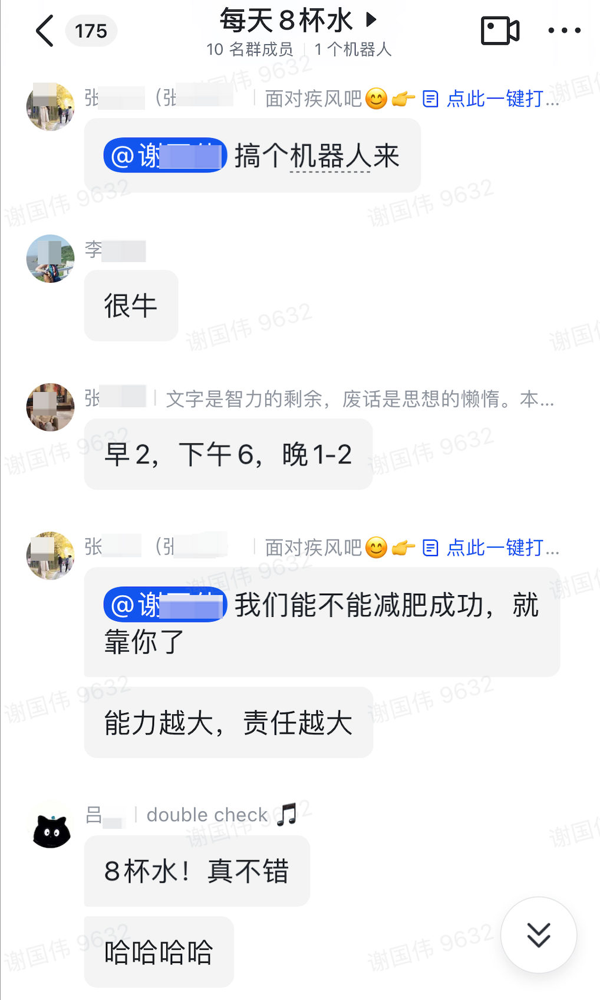
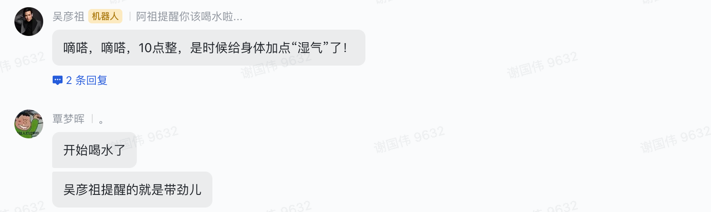
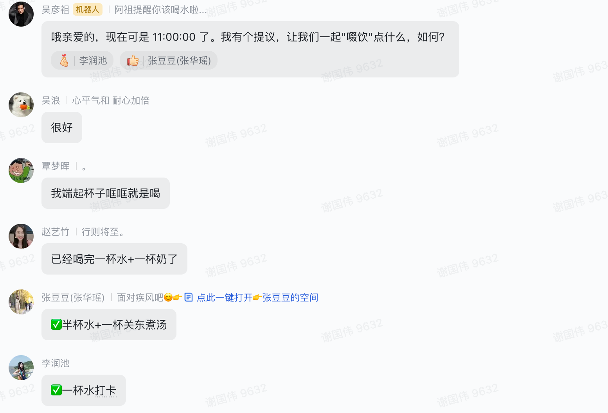

为了帮助那些立志要减肥的同事每天按时喝下八杯水，我做了一个喝水定时器。但如果只是简单的提醒未免有些单调乏味，所以我尝试用大语言模型来生成有趣味的提醒内容，让喝水这件事变得更加有意思，比如像这样：




接下来，用R语言实现这个趣味定时器...
## 配置文件

- 因为我们公司用飞书办公，所以这里使用的是飞书**自定义机器人**，因此我们需要在群聊中创建机器人并拿到webhook_url，具体可参照>>[飞书API文档](https://open.feishu.cn/document/client-docs/bot-v3/add-custom-bot)

- 这里调用的是Gemini的API（因为免费）,因此需要配置你自己的api_key，如果没有可以去这里申请>>[申请地址](https://aistudio.google.com/app/apikey)

- 设置触发提醒的时间，在这些时间整点会触发喝水提醒  
  
  
`config.yml`
```yaml
default:
  # Gemini返回失败时的最大重复尝试次数
  trials: 10
  # 允许提醒的时间
  crontab:
    - 10:00:00
    - 11:00:00
    - 14:00:00
    - 15:00:00
    - 16:00:00
    - 17:00:00
    - 18:00:00
    - 19:00:00
    - 20:00:00
    
  webhook: 
    # 替换成你自己的
    - https://open.feishu.cn/open-apis/bot/v2/hook/xxxxx 
    
gemini:
  api: "https://generativelanguage.googleapis.com/v1beta/models/gemini-pro:generateContent?key="
  token: "xxxxxxxxxxxxx" # 替换成你自己的
  prompt: "用幽默有趣的方式,简短表达这段话：现在的时间是{current_time}，该喝一杯水了"
  
```

## R脚本
`clock.R`
```r
library(config)
library(httr)
library(tidyverse)

gemini <- function(prompt){
  url <- paste0(cnf$api, cnf$token)
  headers <- c('Content-Type' = 'application/json')
  
  body <- list(
    contents = list(
      list(
        parts = list(
          list(
            text = prompt
          )
        )
      )
    )
  )
  
  response <- POST(url, body = body, encode = "json", verbose())
  
  msg <- content(response)[["candidates"]][[1]][["content"]][["parts"]][[1]][["text"]]
  
  return(msg)
}


send_msg <- function(msg, webhook){
  
  print(msg)
  
  body <- list(
    msg_type = "text",
    content = list(text = msg)
  )
  
  response <-
    httr::POST(url = webhook,
               body = list(msg_type = "text",
                           content = list(text = msg)),
               encode = "json",
               add_headers("Content-Type" = "application/json"))
  
  if(response$status_code != 200){
    stop(paste0("\n",
                "status_code ", response$status_code))
  }
  
  if(content(response)$code != 0){
    stop(paste0("\n",
                "failed code: ", content(response)$code,
                "\n",
                "failed msg: ", content(response)$msg))
  }
}


# run --------------------------------------------------------------------------
cnf <- config::get(config = "gemini")

current_time <- format(Sys.time(), "%H:00:00")

if(!current_time %in% cnf$crontab) stop(paste0(current_time, "为禁止提醒时段..."))

prompt <- stringr::str_glue(cnf$prompt) |> as.character()

trails <- 1

while(TRUE){

  msg <- gemini(prompt)
  
  if(!is.null(msg)) {
    purrr::walk(cnf$webhook, ~ send_msg(msg = msg, webhook = .))
    break
  }else(
    trials <- trials + 1
  )
 
  if(trials > cnf$trails) {
    message("尝试次数过多...")
    break
  }
}
```

## 定时任务

接下来设置（本地或服务器）系统定时任务，每个整点执行一次`clock.R`脚本，当执行时间符合配置文件中的定时，就会触发喝水提醒。

- 打开系统定时器
```bash
crontab -e 
```
- 创建定时任务
```bash
00 * * * * cd /home/xiebro/water-clock/; Rscript clock.R >> clock.log 2>&1
```

最后，祝愿我的同事们能够持之以恒、减肥成功...

