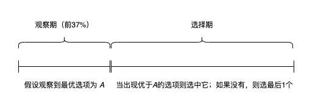

## 37%法则的智慧

当你面对一连串的选择（比如租房、招聘、甚至约会），如何在不回头的情况下最大化选到最佳选项的概率？最优停止理论给出了一个优雅的解决方案——37%法则。

### 核心思想
- 观察期：拒绝前37%的选项（仅用于建立标准）。
- 选择期：在剩下的选项中，选择第一个比观察期内所有选项都好的。
- 如果后续没有更好的，则必须接受最后一个。



### 为什么是37%？
数学证明，当选项数量足够大时，37%（即1/e）是最优观察比例，并且能让你以约37%的概率选到最佳选项。这一策略平衡了探索（收集信息）和利用（做出选择），适用于许多现实决策场景。


## 蒙特卡洛-模拟验证

```r
library(tidyverse)
library(scales)
library(furrr)
set.seed(42)
plan(multisession, workers = availableCores() - 1)
# 创建规则函数 -----------------------------------------------------------------
# 模拟1次策略执行的过程
# 参数：
#   glb_nums: 全局可选项
#   obs_ratio: 观察期比例（例如0.37）
# 返回：
#   boll, 是否选到全局最优
rule_func <- function(glb_opts, obs_ratio) {
  n <- length(glb_opts)
  # 全局最优选项
  glb_best <- max(glb_opts)
  # “观察期”最优选项
  obs_n <- floor(n * obs_ratio)
  obs_opts <- glb_opts[1:obs_n]
  obs_best <- max(obs_opts)

  # “选择期”选择结果
  slct_opts <- glb_opts[(obs_n + 1):n]
  if (obs_best == glb_best) {
    # 当全局最优结果已在“观察期”出现，则接受“选择期”的最后1个选项
    selected <- tail(slct_opts, 1)
  }else{
    # 否则，在“选择期”寻找第一个比“观察期最优”更好的值
    for (i in seq_along(slct_opts)) {
      if (slct_opts[i] > obs_best) {
        selected <- slct_opts[i]
        break
      }
    }
  }

  # 返回是否选择了全局最优
  selected == glb_best
}


# 执行模拟验证 -----------------------------------------------------------------
step <- 0.01 # 模拟“观察期”比例的步长
ratios <- seq(0.01, 0.99, by = step) # 模拟不同的“观察期”长度
trials <- 100000 # 对每个“观察期”的模拟次数
opts <- 1:100 # 全局选项（数字越大则代表越优）

res <- ratios |>
  future_map(~ {
    ratio <- .x
    1:trials |> map_vec(~ {
      rule_func(glb_opts = sample(opts), obs_ratio = ratio)
    })
  }, .progress = TRUE) |>
  map_dbl(mean)

optimal_ratio <- round(ratios[which.max(res)], 4)
optimal_success_rate <- round(max(res), 4)

# 可视化 -----------------------------------------------------------------------
data.frame(ratios = ratios, rate = res) |>
  ggplot(aes(x = ratios, y = rate)) +
  geom_line(linewidth = 1, color = "steelblue") +
  geom_vline(xintercept = optimal_ratio, lty = 4, col = "salmon") +
  geom_hline(yintercept = optimal_success_rate, lty = 4, col = "salmon") +
  scale_x_continuous(labels = scales::percent) +
  scale_y_continuous(labels = scales::percent_format(accuracy = 1)) +
  labs(
    x = "Observation Ratio",
    y = "Probability of Selecting the Best Option",
    title = "Optimal Stopping Strategy Success Rate Analysis",
    subtitle = sprintf(
      "Optimal point: %.1f%% observation → %.1f%% success",
      optimal_ratio * 100, optimal_success_rate * 100
    )
  ) +
  theme_minimal()
```

}}index.en_files/figure-html/unnamed-chunk-1-1.png" width="672" />

从模拟结果中看到，当选项数量为100个时，最优“观察期”长度是0.38（接近于37%），基于该“观察期”长度，选到最优选项的概率是0.372（也同样接近于37%，也许这就是----数学之美）。

37%法则的数学证明中提到：“当选项数量趋近于无穷时，最优“观察期”长度也将逼近37%(1/e)”。所以在不同选项数量的情况下，要酌情考虑是否使用37%作为“观察期”。

