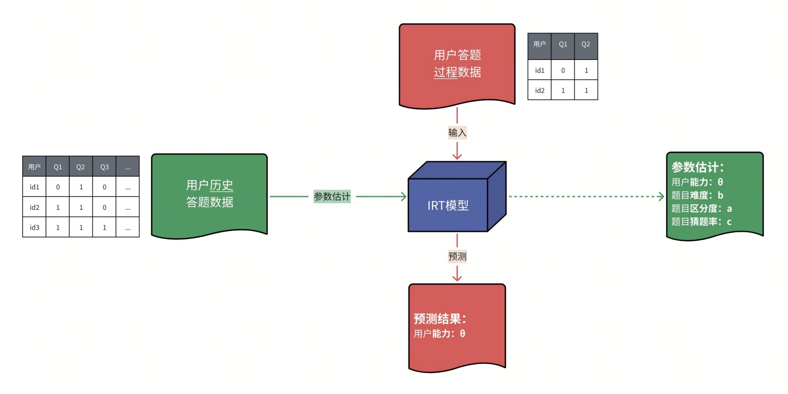
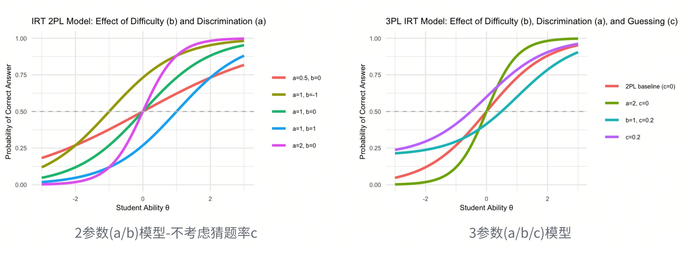
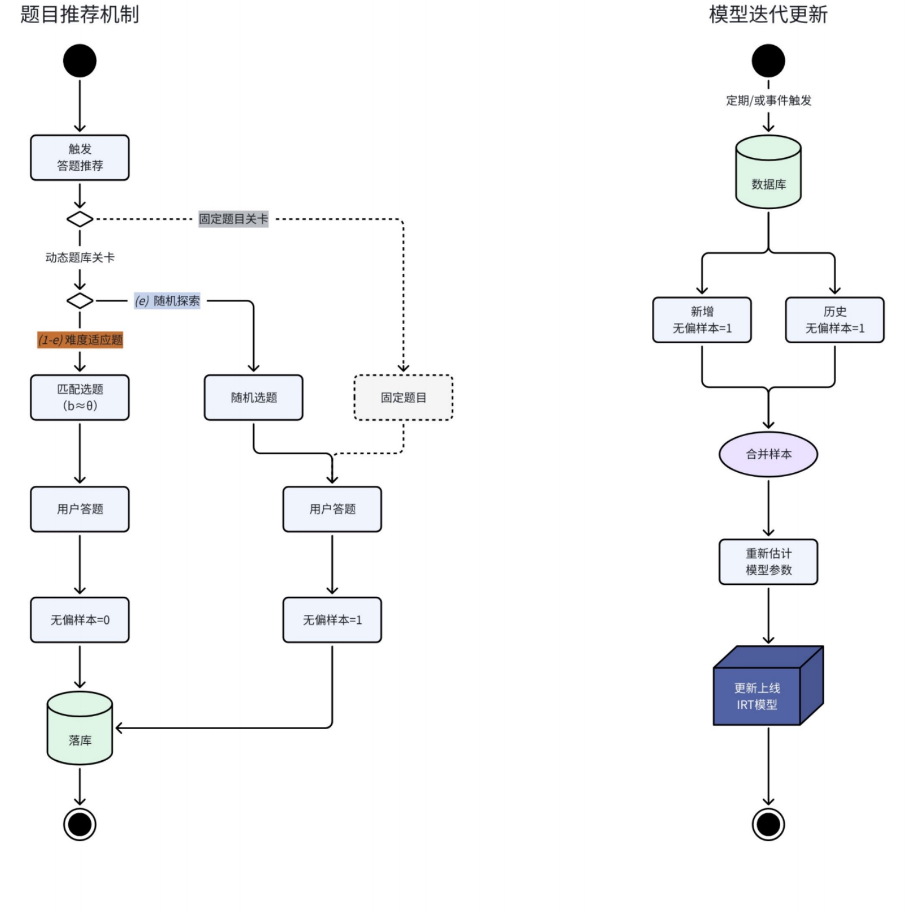
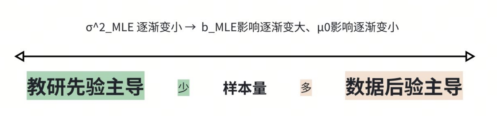
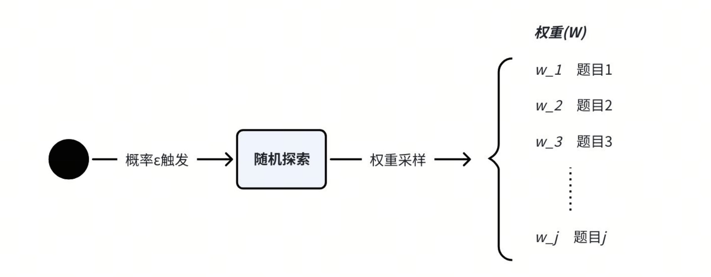

## 背景  
简单讲，就是我们要把“⽤⼾能⼒”与“题⽬难度”建⽴在同⼀把标尺下，从⽽实现“人题自动匹配”的系统。  
- 例如：能⼒为 0.7 的⽤⼾ → 推荐难度为 0.7 的题⽬；  
- 能⼒和难度不是简单的分为“⾼、中、低”，⽽是相同数轴下可⽐较的“连续值”。

解决什么问题？  
- 优化用户体验：调节用户做题难度（实现千人千题）  
- 评估教学效果：使教学效果量化可比  
- 优化题库：为题目建立优化指标（难度/区分度）  

## 简单介绍一下IRT模型
IRT（Item ResponseTheory，项目反应理论）是一种在心理测量与教育评估领域广泛使用的概率模型，用于刻画用户作答结果与其潜在能力之间的关系。  
**核心思想是**：用户是否答对一道题，既取决于题目的难度，也取决于用户的能力；模型能够同时对两者进行估计。  

结合我们的业务场景，可利用历史作答样本离线训练模型，对新作答用户在线预测。  
  

训练模型可以得到以下关键参数：
- **用户潜在能力（θ）**：个体未直接观测到的能力指标，例如数学能力、理解能力  
- **题目参数（a/b/c）**：  
  - 难度（b）：题目所要求的能力阈值，θ=b时答对概率为50%  
  - 区分度（a）：题目对能力差异的敏感程度，a越大，题目越能区分高、低能力个体  
  - 猜题率（c）：能力极低的用户仍能答对该题的概率（主要用于选择题场景）  
基于3PL模型，某个体答对某题目的概率可表示为：  

$$
P(\text{答对}\mid\theta)=c+(1-c)\frac{1}{1+e^{-a(\theta-b)}}
$$

    

**补充解释**：
难度(b)与区分度(a)的区别？
难度指的是题目有多难（谁能做对），区分度指的是题目有多会“分人”（强弱差异有多明显）。  


| 题目        | 低能力正确率 | 高能力正确率 | 结论      |
| ----------- | ------ | ------ | --------------------- |
| 2 + 3 = ?   | 95%    | 99%    | **难度低，区分度低**  |
| 12 × 17 = ? | 30%    | 80%    | **难度中等，区分度高**|
| 微积分证明题| 2%     | 10%    | **难度高，区分度低**  |  

**注意模型局限性**：  
*由于IRT模型有局限性和风险，所以不能“拿来就用”，需要通过系统设计来规避*
- 基于**局部独立假设**：题目作答相互独立，作答顺序不影响正确率；  
- 需要**大样本稳定估计**：新题无足够作答样本，导致参数估计不稳定；  
- 选择带来的**样本偏差**：对不同能力用户有选择性的推题，会导致样本选择偏差，不能直接用来训练迭代模型；  
- θ不是**绝对能力**：是相对尺度，与题库绑定，不同题库的θ不可直接比较。  
  
  
## 通过系统设计规避
**如何解决样本有偏?**  
- 当系统持续根据**难度b≈能力θ**推荐题目，就会产生有偏样本，为了使模型可迭代，就需要定期无偏采样；  
- 因此设计“随机探索”机制，有概率$e$会进行随机选题，以此生产无偏样本。  

  

**如何解决新题参数估计？**  

问题1：新题上线缺乏作答数据，不能稳定估计难度(b)，因此对参数b做渐进式估计(先验初始化 → 探索采样 → 贝叶斯更新 → 参数收敛) 。  

- 新题上线时，由教研配置参数或系统默认初值，作为贝叶斯先验；  
（考虑到课程制作老师不具有建模经验，所以配置时要提供直觉标签，比如：简单、中等、困难，以此映射b先验分布）  
$$
b \sim N(\mu_0, \sigma_0^2)
$$    


- 随样本量积累，对参数进行贝叶斯更新（先验主导 → 逐渐数据主导 →  参数自然收敛）；  

Step1.将新题与旧题样本一起训练模型，得到新题MLE 难度估计$b_\text{MLE}$  
Step2.结合先验，做贝叶斯 MAP 更新：  
$$
b_{\text{MAP}} = \frac{\sigma_0^2}{\sigma_{\text{MLE}}^2 + \sigma_0^2} b_{\text{MLE}} + \frac{\sigma_{\text{MLE}}^2}{\sigma_{\text{MLE}}^2 + \sigma_0^2} \mu_0
$$
  

问题2：新题需要更快的采样，因此要概率倾斜（高权重 → 逐渐降低 → 趋于稳定）。  
$$
W_j = \frac{1}{1+\alpha \log(1 + n_j)}
$$


## Demo

```{r, message = FALSE, info = FALSE}
library(mirt)
library(dplyr)
library(tidyr)
```

```{r}
# 一、模拟用户作答数据
# 假设：
# 500 个用户
# 30 道题目
# 使用 3PL模型生成作答数据 

set.seed(123)

n_user <- 500
n_item <- 30

# 用户能力
theta <- rnorm(n_user, 0, 1)

# 题目参数
a <- runif(n_item, 0.5, 2)      # 区分度
b <- rnorm(n_item, 0, 1)        # 难度
c <- runif(n_item, 0, 0.25)     # 猜题率

# 模拟作答结果
response_matrix <- matrix(0, n_user, n_item)

for(i in 1:n_user){
  for(j in 1:n_item){
    
    p <- c[j] + (1 - c[j]) /
      (1 + exp(-a[j] * (theta[i] - b[j])))
    
    response_matrix[i,j] <- rbinom(1,1,p)
    
  }
}

# Convert to data frame with column names
response_df <- as.data.frame(response_matrix)
colnames(response_df) <- paste0("Item_", 1:n_item)
head(response_df[1:10])

# 二、训练IRT模型
model <- mirt(response_df,
              model = 1,
              itemtype = "3PL")

# 题目参数
item_param <- coef(model, IRTpars = TRUE, simplify = TRUE)$items
head(item_param)

# 三、估计用户能力 θ
# 当新用户做完几道题后，可以估计其能力
theta_est <- fscores(model)
head(theta_est)


# 四、题目推荐逻辑
# 推荐原则：推荐难度接近用户能力的题目
recommend_item <- function(theta_user, item_param, k = 5){
  
  # Convert matrix to data frame for dplyr operations
  item_df <- as.data.frame(item_param)
  
  item_df |>
    mutate(diff = abs(b - theta_user)) |>
    arrange(diff) |>
    slice(1:k)
  
}

recommend_item(theta_est[1], item_param)

# 五、探索机制（避免样本偏差）
recommend_with_explore <- function(theta_user,
                                   item_param,
                                   explore_rate = 0.1){
  
  if(runif(1) < explore_rate){
    
    # 随机探索
    sample(1:nrow(item_param),1)
    
  }else{
    
    # 能力匹配推荐
    which.min(abs(item_param$b - theta_user))
    
  }
}
```

```{r}
# 六、新题参数冷启动及MAP更新
# 先验标签：简单 = -1，中等 = 0，困难 = 1
# b ~ N(μ0, σ0²)
mu0 <- 0
sigma0 <- 1

# 当新题有少量样本后，可以得到：b_MLE
# 然后进行贝叶斯更新：
update_b_map <- function(b_mle,
                         sigma_mle,
                         mu0,
                         sigma0){
  
  b_map <- (sigma0^2 / (sigma_mle^2 + sigma0^2)) * b_mle +
           (sigma_mle^2 / (sigma_mle^2 + sigma0^2)) * mu0
  
  return(b_map)
}

# 示例：
update_b_map(
  b_mle = 0.6,
  sigma_mle = 0.5,
  mu0 = 0,
  sigma0 = 1
)

# 八、新题探索权重机制
explore_weight <- function(nj, alpha = 0.5){
  
  1 / (1 + alpha * log(1 + nj))
  
}

data.frame(
  sample_count = c(0,10,50,200),
  weight = explore_weight(c(0,10,50,200))
)

```

