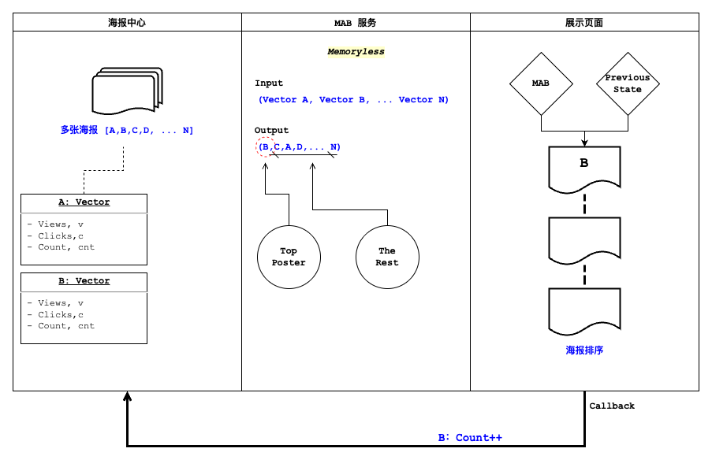

做推荐、做投放、做运营的人，几乎每天都在回答同一个问题：

> **手上有一批候选（几张海报、几套文案、几个出价），流量有限，先把量押给谁？**

押给当前看起来最好的那个，是**利用（exploit）**；分一点量去试试看似平庸、但样本还不够的那些，是**探索（explore）**。多臂老虎机（Multi-Armed Bandit, MAB）就是把这个两难形式化后的最小模型。

这篇文章用一个真实业务里打磨过的场景——**转介绍海报推荐**——把 MAB 从建模讲到验证：先模拟数据，用最经典的 Epsilon-Greedy 建基线，立起三条验证指标做蒙特卡洛复盘；再换上 UCB 和 Thompson Sampling 两种更聪明的策略，看 UCB 默认参数下容易踩的坑、以及 Thompson 如何零超参地做到最好；最后落到一个工程上真正提速的收尾——**UCB 热启动**。

> 文中所有数据均为模拟生成，业务框架取自实际项目、数字与真实经营指标无关。

## 一、多臂老虎机是什么

想象一排老虎机，共 $K$ 个摇臂。每个臂 $a$ 背后有一个**未知**的奖励分布，期望是 $\mu_a$。你有 $N$ 次机会，每次拉一个臂、拿一次奖励，目标是让 $N$ 次的累计奖励最大。

难点全在"未知"两个字：你只能靠拉的过程去估计每个臂的好坏，而每一次用于试探的拉动，都可能是一次本可以拿更高奖励的浪费。

衡量这种浪费的量叫**后悔（regret）**。设最优臂的期望为 $\mu^{\star} = \max_a \mu_a$，第 $t$ 步选了臂 $a_t$，则累计后悔为

$$
R(T) = \sum_{t=1}^{T} \left( \mu^{\star} - \mu_{a_t} \right).
$$

"最大化累计奖励"等价于"最小化累计后悔"——后者是评价一个策略好坏更干净的尺子。一个经典结论先摆在这里：**固定探索率的朴素策略，后悔随时间线性增长；而 UCB 这类基于置信区间的策略，能把后悔压到对数增长** $O(\log T)$。后面我们会用蒙特卡洛把这句话——以及它成立的前提——都"看"出来。

## 二、业务场景与模拟数据

**场景。** 转介绍海报中心里有若干张海报。用户每次进入，系统要决定把哪张海报放到**一号位**（其余按指标排序）。放对了海报，就更可能带来一次新用户触达。

**核心指标：辐射率。** 我们关心的不是曝光、也不是保存，而是

$$
\text{辐射率} = \frac{\text{触新量}}{\text{保存数}},
$$

即每一次"保存"里，能带来多少"触达新用户"。每张海报维护一个状态向量 $(v, c, cnt)$：$v$ 触新量、$c$ 保存数、$cnt$ 被推荐次数。这张海报的辐射率估计就是 $\hat{Q} = v / c$。

**映射到老虎机。** 一张海报 = 一个臂；把它放到一号位并拿到一次保存 = 拉一次臂；这次保存**是否触新**就是奖励 $r \in \{0, 1\}$，服从 $\text{Bernoulli}(p_a)$，其中 $p_a$ 是这张海报的**真实辐射率**。于是"累计辐射率"恰好就是到目前为止的平均奖励。冷启动时给每张新海报先各推一次（轮询），既避免了除零，也拿到一份最初的认知。

整个系统串起来是这样一条数据流：



海报中心为每张海报维护状态向量 $(v, c, cnt)$；MAB 作为一个**无记忆**（memoryless）服务，输入这批向量、输出排好序的海报列表——**一号位**由 MAB 决策，其余按指标排；展示页拿到结果后，用户行为通过 callback 把被选海报的计数（如 `B: Count++`）回写，供下一次调用使用。正因为无记忆，它每次都只依据当前传入的计数做决策，天然适合做成一个无状态的函数式接口。

**模拟数据。** 参考历史经验，转介绍海报的辐射率大致落在 $0.2$ 到 $0.6$ 之间。为了把算法行为看清楚，我们先取 $N=5$ 张辐射率**梯度明显**的海报作为"上帝视角"的真值（辐射率非常接近的难例留到第四节专门讨论）：


``` r
library(tidyverse)
library(furrr)
library(scales)

set.seed(42)

N_PULLS <- 2000   # 单次实验的调用次数（累计保存数）
REPS    <- 400    # 蒙特卡洛重复次数

plan(multisession, workers = max(1, availableCores() - 1))

# 5 张海报的“真实辐射率”，即拉动该臂得到触新（奖励=1）的概率
p_true   <- c(0.20, 0.30, 0.40, 0.50, 0.60)
N_ARMS   <- length(p_true)
best_arm <- which.max(p_true)
p_star   <- max(p_true)
```

最优海报是第 5 张，真实辐射率 $p^{\star} = 0.60$。把 5 张海报的真值画出来：


``` r
tibble(arm = factor(seq_len(N_ARMS)), rate = p_true) |>
  ggplot(aes(rate, fct_rev(arm), fill = arm == as.character(best_arm))) +
  geom_col(width = 0.66) +
  scale_fill_manual(values = c(`TRUE` = unname(palette_blog["rose"]),
                               `FALSE` = unname(palette_blog["blue"])),
                    guide = "none") +
  scale_x_continuous(labels = label_percent(accuracy = 1),
                     limits = c(0, 0.65)) +
  labs(title = "Ground-truth radiation rate of 5 posters",
       subtitle = "Poster #5 is optimal; the algorithm never sees this — it must learn by pulling",
       x = "True radiation rate", y = "Poster") +
  theme_blog()
```

}}index.en_files/figure-html/fig-arms-truth-1.png" alt="" width="888" />

算法当然看不到这张图——它只能通过一次次"放到一号位、观察是否触新"来逼近它。

## 三、MAB 策略建模：Epsilon-Greedy

最直接的探索/利用平衡，就是 **Epsilon-Greedy**：

```text
设定探索率 epsilon ∈ (0, 1)；
每一步抽一个随机数 a ~ U(0, 1)：
  若 a > epsilon：选当前估计辐射率最高的海报（利用）；
  若 a ≤ epsilon：随机挑一张海报（探索）。
```

它的软肋也很直白：

- $\epsilon$ 定大了，即使早已看清优劣，仍要固定地拿出这么多流量去乱试，后悔停不下来；
- $\epsilon$ 定小了，遇到几张辐射率接近的海报，要花很久才能分辨；
- 更关键的是，**探索时它对"第二好"和"最差"一视同仁**——明明只需要在几个尖子里再确认，它却把探索流量均摊给了所有海报，包括早该淘汰的那些。

> **一句带过的替代思路：Softmax。** 与其"要么贪心、要么完全随机"，不如按分数给概率：$\text{softmax}(x_i) = \dfrac{e^{x_i / \tau}}{\sum_j e^{x_j / \tau}}$。好海报拿到更高的被选概率，差海报被压低但不归零；温度 $\tau$ 越大越接近均匀（探索越猛），配合**降温**（annealing）逐步调小 $\tau$，就能从"敢试"平滑过渡到"敢押"。这里就不展开它的仿真了，只作个对照。

下面把两类策略写成同一个仿真函数——它们只差"如何选臂"这一行：


``` r
# 单次实验：给定真值 p_true，跑 n_pulls 步，返回逐步轨迹
# policy: "egreedy" / "ucb" / "thompson"（三种选臂逻辑写在同一处，后文都会用到）
# init_v / init_n: 起始的 (触新, 保存) 计数，缺省为 0；热启动时灌入历史计数
simulate_bandit <- function(p_true, n_pulls,
                            policy  = c("egreedy", "ucb", "thompson"),
                            epsilon = 0.1,
                            c_ucb   = 0.7,
                            init_v  = NULL,
                            init_n  = NULL) {
  policy   <- match.arg(policy)
  K        <- length(p_true)
  best_arm <- which.max(p_true)
  p_star   <- max(p_true)

  v <- if (is.null(init_v)) rep(0, K) else init_v   # 触新累计
  n <- if (is.null(init_n)) rep(0, K) else init_n   # 保存累计（= 被推荐次数）

  is_opt      <- integer(n_pulls)
  reward      <- integer(n_pulls)
  inst_regret <- numeric(n_pulls)

  for (t in seq_len(n_pulls)) {
    arm <- if (any(n == 0)) {
      which(n == 0)[1]                                  # 冷启动：每张海报先各推一次
    } else if (policy == "egreedy") {
      if (runif(1) < epsilon) sample.int(K, 1) else which.max(v / n)
    } else if (policy == "ucb") {
      which.max(v / n + c_ucb * sqrt(log(sum(n)) / n))  # UCB：估计 + 探索加成
    } else {
      which.max(rbeta(K, v + 1, (n - v) + 1))           # Thompson：从各臂 Beta 后验采样
    }

    r <- rbinom(1L, 1L, p_true[arm])                # 这次保存是否触新
    v[arm] <- v[arm] + r
    n[arm] <- n[arm] + 1

    is_opt[t]      <- as.integer(arm == best_arm)
    reward[t]      <- r
    inst_regret[t] <- p_star - p_true[arm]
  }
  list(is_opt = is_opt, reward = reward, inst_regret = inst_regret)
}
```

## 四、建立验证指标，并做蒙特卡洛验证

单跑一次实验，曲线全是噪声，说明不了问题。正确姿势是**蒙特卡洛**：固定海报真值这套"环境"，把在线过程的随机性重复上百次，取平均，看策略的期望行为。

我们盯三条曲线（沿用项目里的定义）：

$$
\text{最优动作比例} = \frac{\text{最优海报被选中的次数}}{\text{调用接口次数}}
$$

$$
\text{累计辐射率} = \frac{\text{累计触新量}}{\text{累计保存量}}
$$

$$
\text{累计后悔} = \sum_{t} \left( \text{最优海报真实辐射率} - \text{被选首位海报真实辐射率} \right)
$$

第一条看**是否收敛到最优臂**，第二条看**赚到的真金白银**，第三条看**为探索付出的代价**。把蒙特卡洛的聚合逻辑封装一下：


``` r
# 跑 REPS 次实验，对齐步数后求三条曲线的均值
mc_run <- function(p_true, n_pulls, reps, policy, label, ...) {
  step <- seq_len(n_pulls)
  sims <- future_map(
    seq_len(reps),
    function(i) simulate_bandit(p_true, n_pulls, policy = policy, ...),
    .options = furrr_options(seed = TRUE)
  )
  opt <- vapply(sims, function(s) cumsum(s$is_opt)      / step, numeric(n_pulls))
  rew <- vapply(sims, function(s) cumsum(s$reward)      / step, numeric(n_pulls))
  reg <- vapply(sims, function(s) cumsum(s$inst_regret),        numeric(n_pulls))
  tibble(step = step, strategy = label,
         opt_ratio     = rowMeans(opt),
         cum_radiation = rowMeans(rew),
         cum_regret    = rowMeans(reg))
}

# 三条曲线的统一画法
metric_labels <- c(opt_ratio     = "Optimal-action ratio",
                   cum_radiation = "Cumulative radiation",
                   cum_regret    = "Cumulative regret")

plot_metrics <- function(df, title, subtitle = NULL) {
  df |>
    pivot_longer(c(opt_ratio, cum_radiation, cum_regret),
                 names_to = "metric", values_to = "value") |>
    mutate(metric = factor(metric_labels[metric], levels = metric_labels)) |>
    ggplot(aes(step, value, color = strategy)) +
    geom_line(linewidth = 0.7) +
    facet_wrap(~metric, scales = "free_y", nrow = 1) +
    scale_color_manual(values = unname(palette_blog[c("blue", "rose", "sage", "gold")])) +
    labs(title = title, subtitle = subtitle,
         x = "Pulls (cumulative saves)", y = NULL, color = NULL) +
    theme_blog()
}
```

跑 Epsilon-Greedy（$\epsilon = 0.1$）：


``` r
eg <- mc_run(p_true, N_PULLS, REPS, policy = "egreedy",
             label = "ε-greedy (ε=0.1)", epsilon = 0.1)

plot_metrics(eg,
  title = "Epsilon-Greedy: Monte-Carlo behaviour",
  subtitle = sprintf("Averaged over %d runs · optimal poster's true rate p* = %.2f",
                     REPS, p_star))
```

}}index.en_files/figure-html/fig-mc-egreedy-1.png" alt="" width="888" />

三条曲线讲了一个完整的故事：

- **最优动作比例**稳步爬升——但受限于那固定的 $\epsilon$，它的天花板大约在 $1-\epsilon+\epsilon/K \approx 0.92$，因为哪怕早已看清优劣，仍有 10% 的流量在随机乱试；
- **累计辐射率**逼近 $p^{\star}=0.60$，但始终差一口气——同样是那 10% 探索在往一号位塞次优海报；
- **累计后悔**因此没有走平，而是保持近似**线性**的爬升——这正是固定 $\epsilon$ 的宿命。

### 一个经典难例：两张海报几乎一样好

Epsilon-Greedy 最难受的情形，是最优和次优**辐射率极度接近**。我们造一个：让前两名只差万分之二。


``` r
p_close  <- c(0.30, 0.40, 0.50, 0.5999, 0.6001)  # 第 4、5 张几乎打平

eg_close <- mc_run(p_close, N_PULLS, REPS, policy = "egreedy",
                   label = "ε-greedy · near-tied leaders", epsilon = 0.1)

plot_metrics(eg_close,
  title = "Hard case: top two posters are nearly tied",
  subtitle = "Optimal-action ratio stalls, yet cumulative radiation is barely affected")
```

}}index.en_files/figure-html/fig-mc-closearms-1.png" alt="" width="888" />

**最优动作比例**这次怎么都收不上去——因为两张海报的奖励分布几乎无法区分，算法在它俩之间反复横跳。但注意**累计辐射率**几乎不受影响，稳稳贴着 $p^{\star} \approx 0.6$：既然两张海报一样好，选错了也不亏。这提醒我们：**"是否收敛到最优臂"和"是否赚到钱"是两回事**，评估时要分开看。

## 五、UCB 策略建模

Epsilon-Greedy 的探索是"盲目"的——掷个骰子决定要不要乱试。**UCB（Upper Confidence Bound）** 换了个思路：**乐观地面对不确定性**。它给每个臂算一个"可能达到的上界"，然后永远选上界最高的那个：

$$
\text{UCB}(a) = Q_t(a) + c \cdot \sqrt{\frac{\log N}{n(a)}}
$$

- $Q_t(a)$：臂 $a$ 当前的预期奖励（辐射率估计 $v/c$）；
- $n(a)$：臂 $a$ 被推荐的次数；$N$：所有臂被推荐的总次数；
- $c$：探索因子。

这个式子的第一直觉是：**它由两部分组成——预期奖励 + 探索欲望**。

- 探索欲望 $\sqrt{\log N / n(a)}$ 随 $n(a)$ 增大而衰减：一个臂拉得越多，你对它越有把握，就越没必要再为"探索"去选它；
- 它又与 $\log N$ 挂钩，体现的是**相对稀有度**——在别人都被拉了很多次的当口，一个很少被碰的臂会被"补偿"性地抬一手。

由 Hoeffding 不等式可以证明，这个上界以高概率覆盖真实均值，从而给出后悔的对数级保证。相比 Epsilon-Greedy，UCB 有两个工程上很实在的好处：

1. **没有随机性**——任何时刻的选择都能由当前数据完全复算，便于排查和回溯；
2. **对场景无知也能冷启动**——探索欲望项会自动逼着每个没被充分了解的臂被试到，不依赖先验。

选臂逻辑我们前面已经写进 `simulate_bandit` 了（`policy = "ucb"` 那一行），直接拿来对打。

## 六、蒙特卡洛对比：UCB、Thompson 与热启动

### 先看默认探索因子 c=2

UCB1 的教科书默认 $c=2$。把它和 Epsilon-Greedy 摆在一起：


``` r
ucb2 <- mc_run(p_true, N_PULLS, REPS, policy = "ucb",
               label = "UCB (c=2)", c_ucb = 2)

plot_metrics(bind_rows(eg, ucb2),
  title = "Default UCB (c=2) vs Epsilon-Greedy",
  subtitle = "With low-reward, narrow-gap radiation rates, the default c=2 over-explores")
```

}}index.en_files/figure-html/fig-mc-ucb-vs-eg-1.png" alt="" width="888" />

意外吗？**默认 $c=2$ 的 UCB 反而输给了 $\epsilon$-greedy**：最优动作比例更低、累计后悔更高。原因藏在奖励尺度里——$c=2$ 是按"奖励取值铺满 $[0,1]$"校准的，而辐射率的臂间差距只有约 $0.1$、伯努利奖励的方差却接近满档。探索加成 $c\sqrt{\log N / n(a)}$ 因此远大于真实差距，UCB 把大量流量摊在了"其实已经能分辨"的臂上。

这正是"无超参"的另一面：**你不调 $c$，UCB 也会跑，但未必跑得好**。$c$ 不是可有可无的旋钮，而是要和奖励尺度对齐的。

### 探索因子 c 的取舍

先不跑仿真，光看探索加成 $c\sqrt{\log N / n(a)}$ 随累计次数的变化：


``` r
expand_grid(N_total = seq(200, 20000, by = 100),
            n_arm   = c(500, 1000),
            c_ucb   = c(0.7, 2)) |>
  mutate(bonus = c_ucb * sqrt(log(N_total) / n_arm)) |>
  ggplot(aes(N_total, bonus,
             color = factor(c_ucb), linetype = factor(n_arm))) +
  geom_line(linewidth = 0.7) +
  scale_color_manual(values = unname(palette_blog[c("sage", "rose")]),
                     name = "Exploration factor c") +
  scale_linetype_manual(values = c(`500` = 1, `1000` = 2),
                        name = "Times this arm pulled n(a)") +
  labs(title = "Exploration bonus vs cumulative pulls",
       subtitle = "Smaller c and larger n(a) shrink the bonus — the arm leans toward exploiting",
       x = "Cumulative pulls N", y = "Exploration bonus") +
  theme_blog()
```

}}index.en_files/figure-html/fig-cfactor-bound-1.png" alt="" width="888" />

既然默认值偏大，就把 $c$ 调小。三档 $c$ 一起跑：


``` r
c_grid <- map_dfr(c(2, 1, 0.7), function(cc) {
  mc_run(p_true, N_PULLS, REPS, policy = "ucb",
         label = sprintf("UCB (c=%.1f)", cc), c_ucb = cc)
})

plot_metrics(bind_rows(eg, c_grid) |>
               mutate(strategy = fct_relevel(strategy, "ε-greedy (ε=0.1)")),
  title = "Tuning the exploration factor: c = 2 / 1 / 0.7",
  subtitle = "At c = 0.7 UCB converges fastest with the lowest regret — overtaking ε-greedy")
```

}}index.en_files/figure-html/fig-mc-cfactor-1.png" alt="" width="888" />

把 $c$ 收到 $0.7$，UCB 就明显反超了 $\epsilon$-greedy：最优动作比例的平台更高（不像 $\epsilon$-greedy 被 $1-\epsilon$ 卡住），累计后悔也最平。**这不是巧合，而是项目里最终采用的设置。** 代价也要说清楚：更小的 $c$ 探索更省，遇到第四节那种"两张海报几乎打平"的情形，会更容易过早锁定、甚至押错略差的那张——所以 $c$ 的取值本质上是在"收敛速度"和"分辨接近臂的耐心"之间做权衡。

### 第三种思路：Thompson Sampling（零超参的贝叶斯采样）

ε-greedy 要调 $\epsilon$，UCB 要调 $c$。有没有连超参都省了的？**Thompson Sampling**（汤普森采样）就是。

它的想法很贝叶斯：不去估一个"点"辐射率，而是为每张海报维护一个**辐射率的后验分布**。伯努利奖励下这个后验恰好是 Beta 分布——用触新数 $v$ 和"保存但没触新"数 $c - v$ 当参数：

$$
p_a \sim \text{Beta}(v_a + 1, (c_a - v_a) + 1)
$$

每一步，从每张海报各自的后验里**采样**一个辐射率，谁采得最高就把谁放一号位；拿到反馈再更新对应海报的后验。被试次数少的海报后验又宽又不确定，偶尔会采出一个偏高的值从而获得被试的机会——**探索由此自然发生，不需要任何显式的探索率或探索因子**。选臂就是 `simulate_bandit` 里的最后一支：`which.max(rbeta(K, v + 1, (n - v) + 1))`。

把三种策略摆在一起（UCB 用调好的 $c=0.7$）：


``` r
ucb07    <- mc_run(p_true, N_PULLS, REPS, policy = "ucb",
                   label = "UCB (c=0.7)", c_ucb = 0.7)
thompson <- mc_run(p_true, N_PULLS, REPS, policy = "thompson",
                   label = "Thompson Sampling")

plot_metrics(
  bind_rows(eg, ucb07, thompson) |>
    mutate(strategy = fct_relevel(strategy,
                                  "ε-greedy (ε=0.1)", "UCB (c=0.7)", "Thompson Sampling")),
  title = "Three classic strategies head to head",
  subtitle = "Thompson Sampling converges fastest with the lowest regret — and zero hyperparameters")
```

}}index.en_files/figure-html/fig-mc-three-1.png" alt="" width="888" />

结果很干脆：**Thompson Sampling 在三条曲线上全面领先**，最优动作比例最高、累计后悔最低，却连一个超参都不用调。这也是它在实践中广受欢迎的原因——尤其像转介绍海报这种伯努利奖励（触新/没触新）的场景，Beta 后验是天然契合的建模。

那为什么工程上我们最后仍以 UCB 落地？因为 Thompson 带随机性，每次决策不可复算、不便回溯；而 UCB **无随机、可复算，且很容易把历史认知灌成先验做热启动**。

### UCB 热启动

冷启动的 UCB 已经不错，但线上还有一个朴素的浪费：**对那些早有历史数据、明知优劣的海报，我们还在从零开始重新认识它们。** 既然历史已经告诉我们哪些海报好，为什么不把这份认知直接搬进算法的起点？

这就是**热启动（warm start）**：用海报**近期历史的触新量 / 保存量**作为 $v$、$n$ 的初值（而不是从 0 开始），让算法一上来就站在历史认知的肩膀上。


``` r
set.seed(11)
# 模拟一段离线历史：每张海报约积累 40 次保存，触新数由真实辐射率生成
hist_n <- rpois(N_ARMS, lambda = 40) + 5
hist_v <- rbinom(N_ARMS, size = hist_n, prob = p_true)

warm <- bind_rows(
  mc_run(p_true, N_PULLS, REPS, policy = "ucb",
         label = "UCB cold-start (c=0.7)", c_ucb = 0.7),
  mc_run(p_true, N_PULLS, REPS, policy = "ucb",
         label = "UCB warm-start (c=0.7)", c_ucb = 0.7,
         init_v = hist_v, init_n = hist_n)
)

plot_metrics(warm,
  title = "UCB warm start: seed the estimates with history",
  subtitle = "The warm start begins near the top, skipping almost the entire cold-start exploration")
```

}}index.en_files/figure-html/fig-mc-warmstart-1.png" alt="" width="888" />

热启动的**最优动作比例**几乎一上来就在高位——它省掉了整段"从头认识每张海报"的冷启动流量；**累计后悔**也被压到冷启动的一半以下。换算成线上，这意味着实验能更快收敛、更早决定是否放量，把宝贵的流量从"交学费"挪到"赚收益"。

## 小结

这几种做法连起来，是一条"让探索越来越便宜"的路：

1. **MAB** 把"探索 vs 利用"变成一个可计算的问题，用**后悔**当尺子；
2. **Epsilon-Greedy** 是最直接的基线，但盲目探索让它的后悔线性增长，且对次优和最差一视同仁；
3. **UCB** 用"乐观面对不确定性"取代掷骰子——无随机、可复算、能冷启动；但它的探索因子 $c$ **必须和奖励尺度对齐**，默认的 $c=2$ 在辐射率这种窄差距场景会过度探索，调到 $0.7$ 才真正跑赢基线；
4. **Thompson Sampling** 把探索变成"从各臂的 Beta 后验里采样"，零超参、在这组测试里表现最好；代价是带随机、不可复算；
5. **UCB 热启动** 是工程落地的选择——正因为 UCB 无随机、可复算、易灌历史先验，把认知灌进起点后，让探索越来越便宜。

而真正让这套演进可信的，是贯穿始终的**蒙特卡洛验证**：不看单次跑的偶然曲线，而是固定环境、重复上百次，用最优动作比例 / 累计辐射率 / 累计后悔三条均值曲线，去回答"它到底收没收敛、赚没赚到、值不值"这三个独立的问题。也正是这套验证，让我们在上线前就看清了"默认 $c=2$ 并不好"这件事。


---

*参考：[动手学强化学习 · 多臂老虎机](https://hrl.boyuai.com/chapter/1/%E5%A4%9A%E8%87%82%E8%80%81%E8%99%8E%E6%9C%BA/)；[不只是 A/B 测试：多臂老虎机赌徒实验](https://blog.csdn.net/u011984148/article/details/106678502)。*
