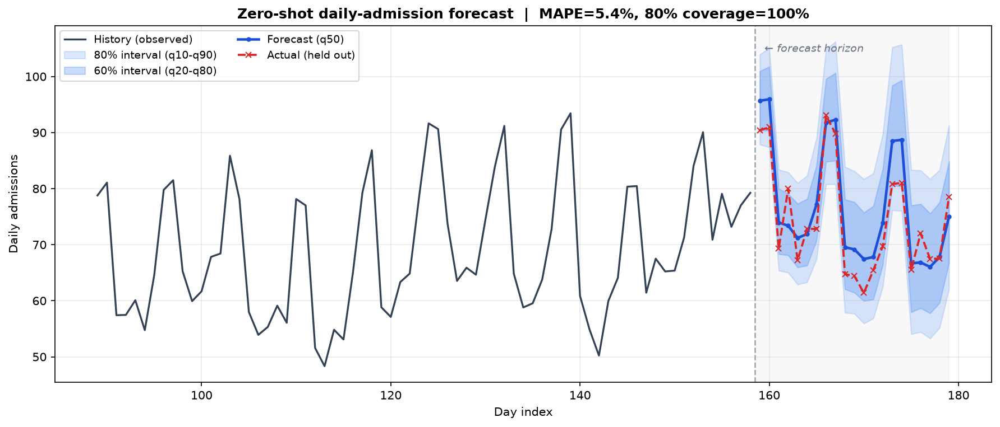
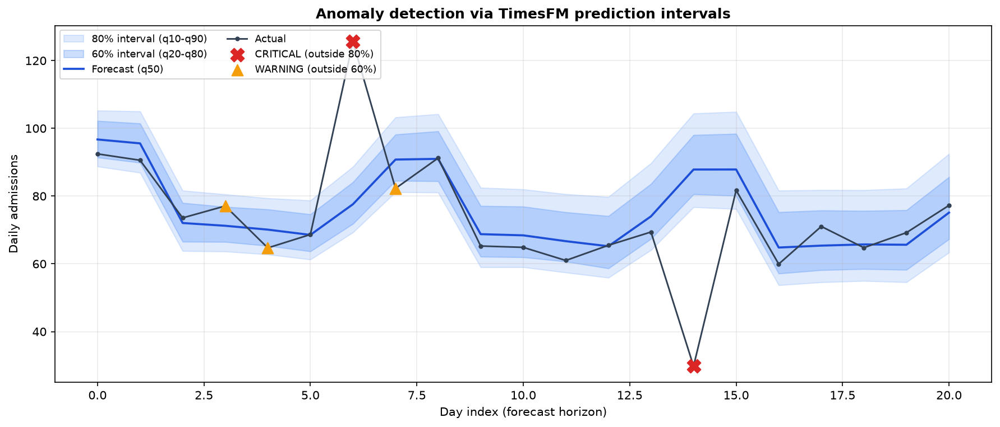
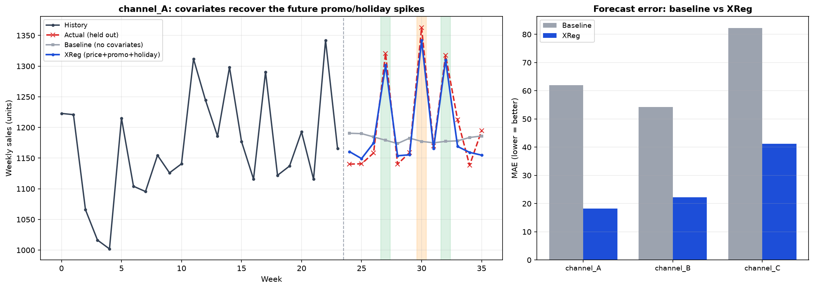

做招生、做投放、做运营的，几乎每天都在回答同一个问题：

> **下周这个渠道的量大概多少？会不会掉？掉了是正常波动还是出事了？**

以前回答这个，得给每条序列单独配个模型：这个渠道用 ARIMA，那个指标套 Prophet，季节项、节假日再手动调一遍。渠道一多、指标一杂，光是维护这一堆各管一段的小模型就够喝一壶了。TimesFM 换了个思路：不再为每条序列训模型，而是拿一个在海量时间序列上预训练好的大模型，喂进一段历史，直接读出未来。跟 GPT 处理文本一个路子，只是它读的是数值。

这篇不推公式，就把 TimesFM 拿到运营场景里真跑一遍。先说清它凭什么能"零样本"预测、内部大概怎么转，再用三个场景把代码和图摆出来：渠道日招生量预测、招生量异常检测、带促销和价格协变量的销量预测。

> 文中数据都是模拟生成的，业务框架取自日常运营场景，数字跟真实经营指标无关。模型是 Google 开源的 TimesFM 2.5（200M），本地 CPU 就能跑。

## 一、什么是"时序基础模型"

传统预测模型基本是一序列一模型：它只见过你这一条数据，换个对象就得重新拟合、重新调参。TimesFM 反过来，它在大量跨领域的时间序列上预训练过——电力、金融、天气、零售、传感器都有——学的是"时间序列大致长什么样、会怎么走"这种通用规律。所以碰到一条没见过的新序列，它不用在你的数据上训练，推理时读一段历史上下文，就能给出预测和区间。这叫零样本（zero-shot）预测。

可以这么理解：传统模型像个只翻过技术手册的译者，手册翻得挺熟，换本小说就抓瞎；基础模型更像读过各种书的人，给他一段没读过的文字也能大致顺下去。差别就在要不要专门为你这份数据训练一遍。

体现在流程上，传统 ML 那套是 `数据 → 划分 → 训练 → 验证`，动辄小半天；TimesFM 是 `数据 → 载入权重 → 预测`，几秒钟的事。

TimesFM 出自 Google 的论文 *A Decoder-Only Foundation Model for Time-Series Forecasting*（ICML 2024），是个 decoder-only 的 Transformer，跟语言模型同一个家族，只是把"token"从词换成了一段段数值。

## 二、它内部大概怎么转

它能这么用，背后大概是三件事在起作用。

**Patching：把数值切成块再喂进去。** 一条几千上万点的序列，一个时间点当一个 token 的话，又长又碎。TimesFM 的做法是分块（patch）：连续 32 个点打包成一个输入 token，连续 128 个点作为一个输出 token。这样一条 2048 点的历史就变成约 64 个输入 token，生成时一次吐 128 个点。读得细、写得粗——读历史要看清纹理，往外生成时大步走更省算力。2.5 版把上下文窗口拉到了 16384。

**Decoder-only + 因果注意力 + 自回归。** 和 GPT 一样，它带因果掩码（只能看过去、看不到未来），一个 patch 一个 patch 地自回归生成：先根据历史生成第一个未来 patch，接上，再生成下一个。位置信息用旋转位置编码（RoPE），归一化用 RMSNorm，都是现在 Transformer 的标配，长序列外推更稳，这里不展开。

**RevIN 实例归一化，零样本能跨量纲靠的就是它。** 招生量是几十上百，GMV 是几十万，气温在 0 上下。一个模型怎么同时吃这些量级？靠的是进模型前先标准化、出来再还原：

$$
\tilde{x} = \frac{x - \mu}{\sigma} \quad\xrightarrow{\ \text{model}\ }\quad \hat{x} = \hat{\tilde{x}} \cdot \sigma + \mu
$$

模型自始至终只看到均值 0、方差 1 的标准形态，预测完再乘回这条序列自己的 $\sigma$、加回 $\mu$。所以同一套权重，招生量能预测，GMV 也能，气温还行。对应到 API 就是 `normalize_inputs=True` 这个开关，多尺度的数据基本一直开着。

## 三、上手：三步就能预测

TimesFM 2.5 的接口挺简单，就三步：载入 → compile 配置 → forecast。

``` python
import torch
import timesfm

torch.set_float32_matmul_precision("high")

# 1) 载入预训练权重（首次会从 HuggingFace 下载 ~800MB）
model = timesfm.TimesFM_2p5_200M_torch.from_pretrained(
    "google/timesfm-2.5-200m-pytorch", torch_compile=False,
)

# 2) 配置预测行为
model.compile(timesfm.ForecastConfig(
    max_context=512,                   # 往回看多长
    max_horizon=21,                    # 往前预测多长
    normalize_inputs=True,             # RevIN：跨量纲的开关
    use_continuous_quantile_head=True, # 更好校准的分位数区间
    fix_quantile_crossing=True,        # 保证 q10<=q20<=...<=q90 单调不交叉
))

# 3) 零样本预测（inputs 是一批序列，可以一次喂多条）
point_forecast, quantile_forecast = model.forecast(horizon=21, inputs=[series])
# point_forecast:    (N, 21)      # 两个输出的结构见下文
# quantile_forecast: (N, 21, 10)
```

在往下看场景之前，先把**输入和输出的数据结构**理清楚，后面三个场景都是这一套。

**输入 `inputs`** 是一个列表，每个元素是一条序列（一维数组）。多条序列长度可以不一样，模型内部会自己截断/对齐，不用你手动补齐：

```
inputs = [                       # 一个 list，装 N 条序列
    np.array([12, 15, 13, ...]), #   序列①：比如 159 天历史，一维
    np.array([88, 90, ...]),     #   序列②：长度可以和①不同
]                                #   本文场景一只喂 1 条，即 N=1
```

**输出**是两个数组，形状里 `N` = 序列条数、`H` = 预测步数（horizon）：

```
point_forecast     shape (N, H)       每条序列未来 H 步的点预测（= q50 中位数）
quantile_forecast  shape (N, H, 10)   每条序列、每一步，给出 10 个分位数

# 场景一里 N=1、H=21，于是：
#   point_forecast    -> (1, 21)
#   quantile_forecast -> (1, 21, 10)
```

`quantile_forecast` 最后那一维的 10 个数，含义按索引**固定排布**：

| 索引 | 0 | 1 | 2 | 3 | 4 | 5 | 6 | 7 | 8 | 9 |
|:--|:--:|:--:|:--:|:--:|:--:|:--:|:--:|:--:|:--:|:--:|
| 含义 | mean | q10 | q20 | q30 | q40 | q50 | q60 | q70 | q80 | q90 |

注意 index 0 是**均值 mean，不是 q10**，分位数从 index 1 才开始，取的时候留意：

``` python
qf = quantile_forecast[0]     # 取第 1 条序列 -> (21, 10)
# ❌ 错：lower = qf[:, 0]  这是 mean！
# ✅ 对：
q10, q50, q90 = qf[:, 1], qf[:, 5], qf[:, 9]   # 10% / 50%(中位数) / 90%
```

`q10~q90` 围出的是 80% 预测区间，`q20~q80` 是 60% 区间，点预测 `point_forecast` 就等于 `q50`。

## 四、场景一：渠道日招生量的零样本预测

**场景。** 某体验课渠道的日招生量，带明显的周季节性（周末报名更旺）和缓慢的上升趋势。模拟 180 天，把最后 21 天藏起来当"标准答案"，让模型只看前面，去预测这 21 天。

``` python
import numpy as np

def make_admission_series(n_days=180, seed=42):
    rng = np.random.default_rng(seed)
    t = np.arange(n_days)
    trend  = 42 + 0.16 * t                                    # 缓慢爬坡的大盘
    dow    = t % 7                                            # 0=周一 ... 6=周日
    weekly = np.where(dow >= 5, 22, 0) + np.where(dow == 4, 8, 0)  # 周末更旺
    season = 6 * np.sin(2 * np.pi * t / 30)                  # 月度小波动
    noise  = rng.normal(0, 4, n_days)
    return np.clip(trend + weekly + season + noise, 0, None).astype(np.float32)

HORIZON = 21
full = make_admission_series()
context, actual_future = full[:-HORIZON], full[-HORIZON:]   # 藏起最后 21 天

point_forecast, quantile_forecast = model.forecast(horizon=HORIZON, inputs=[context])
```

结果如下。蓝线是点预测，深浅两条蓝带分别是 60% / 80% 区间，红色虚线是藏起来的真实值：



模型没在这条序列上训练、也没调过参，但周末抬头的节律基本复现出来了，MAPE 5.4%；藏起来的 21 天真实值全落在 80% 区间里（覆盖率 100%）。给一段历史，点预测和不确定区间就一起出来了。

> 对运营来说，那条蓝带有时比中间那根线更有用：它把正常波动的上下界圈了出来。

## 五、场景二：用预测区间做异常检测

既然模型已经给出了"正常情况下该落在哪个区间"，那实际值一旦跑出区间，就可以当异常信号看，不用再单独搞一个异常检测模型。规则也简单：

- 实际值落在 80% 区间（q10~q90）之外 → `CRITICAL`
- 落在 60% 区间（q20~q80）之外、但还在 80% 内 → `WARNING`
- 否则 → `NORMAL`

在验证段人为注入两个异常：第 6 天一次大促尖峰（+70%），第 14 天一次投放系统故障塌陷（掉到 35%）。

``` python
actual[6]  *= 1.7    # 大促尖峰
actual[14] *= 0.35   # 系统故障塌陷

qf = quantile_forecast[0]
q10, q20, q80, q90 = qf[:, 1], qf[:, 2], qf[:, 8], qf[:, 9]

severity = np.full(HORIZON, "NORMAL", dtype=object)
severity[(actual < q20) | (actual > q80)] = "WARNING"    # 先标 60% 外
severity[(actual < q10) | (actual > q90)] = "CRITICAL"   # 再覆盖 80% 外
```



两个注入的异常都被判成 `CRITICAL`（红叉）：第 6 天实际 125.6，正常区间上界才到 88.7；第 14 天实际 29.8，下界还在 76.7。几个贴着边界的小波动标成了 `WARNING`（橙三角）。相当于一次预测顺带干了监控告警的活——日常盯盘不用再给每个指标拍一个"跌 10% 就报警"的死阈值，区间会随历史波动性自己收放。

## 六、场景三：把已知的促销/节假日喂给模型（协变量 XReg）

前两个场景只用了历史序列本身。但运营里很多未来其实是提前知道的：下周三要大促、下个月有假期、这批课准备调价。这些已知的外部信息就是协变量（covariates），TimesFM 2.5 通过 XReg 支持（要 `pip install timesfm[xreg]`）。

协变量分动态、静态两类，都以「字典」传入——key 是协变量名，value 是"每条序列一个元素"的列表，按下标和 `inputs` 对齐。区别只在于那个元素是一整条数组还是一个标量：

| 参数 | 每条序列给什么 | 长度 | 例子 |
|:--|:--|:--|:--|
| `dynamic_numerical_covariates` | 一条时间序列 | `context + horizon` | 价格 `price` |
| `dynamic_categorical_covariates` | 一条时间序列 | `context + horizon` | 是否促销 / 节假日 |
| `static_numerical_covariates` | 一个标量 | 1 | 基准客单价 |
| `static_categorical_covariates` | 一个标量（int / 字符串） | 1 | 渠道类型 `store_type` |

动态协变量得覆盖 `context + horizon`——未来那段的值也要给全，模型正是靠"未来的促销安排"去修正预测的；静态协变量一条序列只给一个固定值。拿本场景的 3 个渠道（context=24 周、horizon=12 周）落到具体形状：

``` python
inputs = [ sales_A, sales_B, sales_C ]                    # 目标序列：每条长 24（各自历史）

dynamic_numerical_covariates = {
    "price":     [ price_A, price_B, price_C ],           # 每条长 36 = 24 + 12
}
dynamic_categorical_covariates = {
    "promotion": [ [0, 0, 1, 0, ...], ... ],             # 每条长 36，值 0/1
    "holiday":   [ [0, 0, 0, 1, ...], ... ],
}
static_categorical_covariates = {
    "store_type": [ "premium", "standard", "discount" ],  # list 长 3，每条序列一个值
    "region":     [ "urban",   "suburban", "rural"    ],
}
```

`inputs` 和这几个 list 都靠**下标**一一对应（不是靠名字），顺序、长度（= 序列条数）必须一致。

有一点值得点破：这些协变量并不进 Transformer 主干，而是走一条**线性回归旁路**。类别值先做 one-hot，动态协变量按 `context` / `horizon` 切成两段，一起喂给一个 in-context 线性模型；Transformer 主干只吃目标序列，两路结果最后按 `xreg_mode` 合并。输出结构和 `forecast()` 一样是点预测 + 分位数，只是按序列组织成 list（`xreg_pf[i]` 就是第 i 条序列未来 H 步的预测）。

模拟 3 个渠道的周销量，在未来 horizon 段里放进两次促销、一次节假日。这些尖峰纯看历史猜不出来，但作为协变量喂进去就能补上：

``` python
# baseline：只喂历史，模型看不到未来的促销/节假日
# （开了 return_backcast 后 forecast() 输出含 backcast，未来段取最后 HORIZON 个）
base_raw, _ = model.forecast(horizon=HORIZON, inputs=list(context_inputs))
base_pf = np.asarray(base_raw)[:, -HORIZON:]

# XReg：把 price / promotion / holiday 作为协变量
xreg_pf, _ = model.forecast_with_covariates(
    inputs=list(context_inputs),
    dynamic_numerical_covariates={"price": [prices[s] for s in ids]},
    dynamic_categorical_covariates={
        "promotion": [promos[s].astype(int) for s in ids],
        "holiday":   [holidays[s].astype(int) for s in ids],
    },
    static_categorical_covariates={
        "store_type": [stores[s]["type"] for s in ids],
        "region":     [stores[s]["region"] for s in ids],
    },
    xreg_mode="xreg + timesfm",   # 默认：先 TimesFM 出基线，再用协变量拟合残差
)
```



左图里，灰线（无协变量的 baseline）在未来段只会顺着趋势平走，绿色促销周和橙色节假日周的尖峰全错过了；蓝线（XReg）吃到了"未来这几周有促销/节假日"的信息，就把尖峰顶了上去。右图的 MAE 对比也很清楚，三个渠道从 `62 / 54 / 82` 降到 `18 / 22 / 41`，大概降到原来的三分之一。

`xreg_mode` 有两种，分工不太一样：

- `"xreg + timesfm"`（默认）：先让 TimesFM 出基线，再用协变量拟合残差。适合协变量解释的是偏离主趋势的那部分，比如促销、节假日这种脉冲。
- `"timesfm + xreg"`：先用协变量回归出主信号，再让 TimesFM 预测残差。适合协变量本身就是主要驱动力，比如气温对用电量。

## 七、几个容易踩的坑

1. 分位数索引 off-by-one：`quantile_forecast[..., 0]` 是 mean 不是 q10，分位数从 index 1 起，别取错。
2. 2.5 去掉了频率标志：老版本（1.0 / 2.0）要传 `freq=[0]` 之类，2.5 不需要了，接口清爽不少。
3. 动态协变量长度 = context + horizon：未来段的值也要给全，否则报错。
4. `normalize_inputs=True` 基本一直开：多尺度数据不开 RevIN，效果会明显变差。
5. XReg 要先开 `return_backcast=True`，开完 `forecast()` 输出会带 backcast，取未来段记得切最后 `horizon` 个点——我在场景三就为这个形状栽过一次。

---

*参考：[A Decoder-Only Foundation Model for Time-Series Forecasting (ICML 2024)](https://arxiv.org/abs/2310.10688)；[Google Research Blog](https://research.google/blog/a-decoder-only-foundation-model-for-time-series-forecasting/)；[TimesFM on HuggingFace](https://huggingface.co/collections/google/timesfm-release-66e4be5fdb56e960c1e482a6)。文中三张图都是本地跑 TimesFM 2.5（200M, PyTorch）在模拟数据上生成的。*
