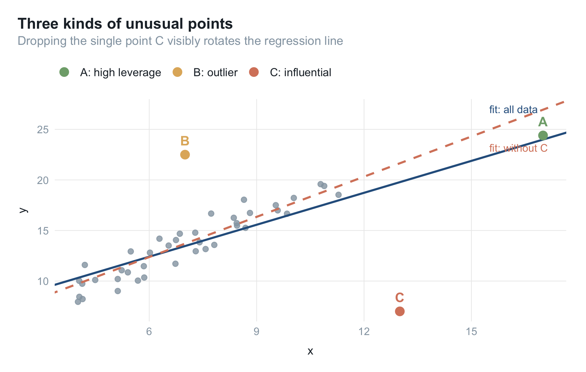
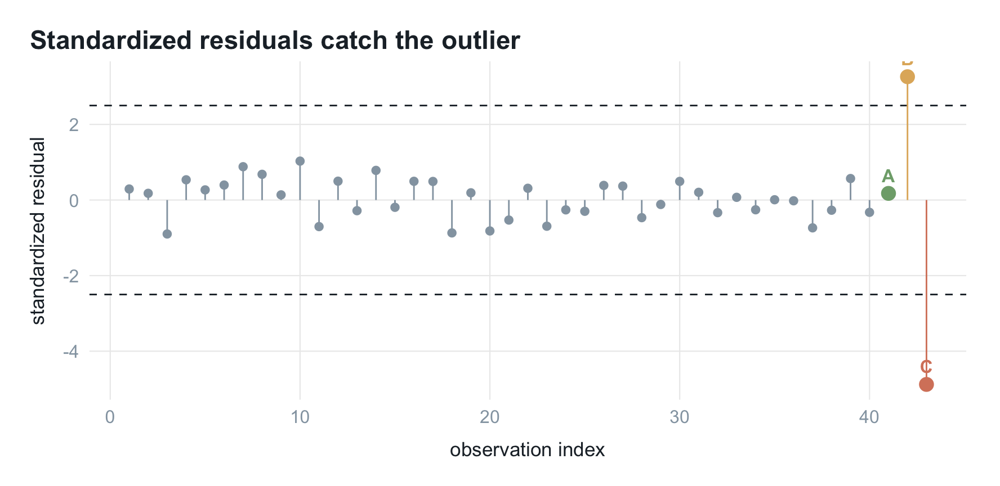
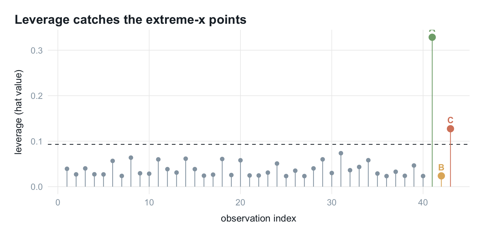
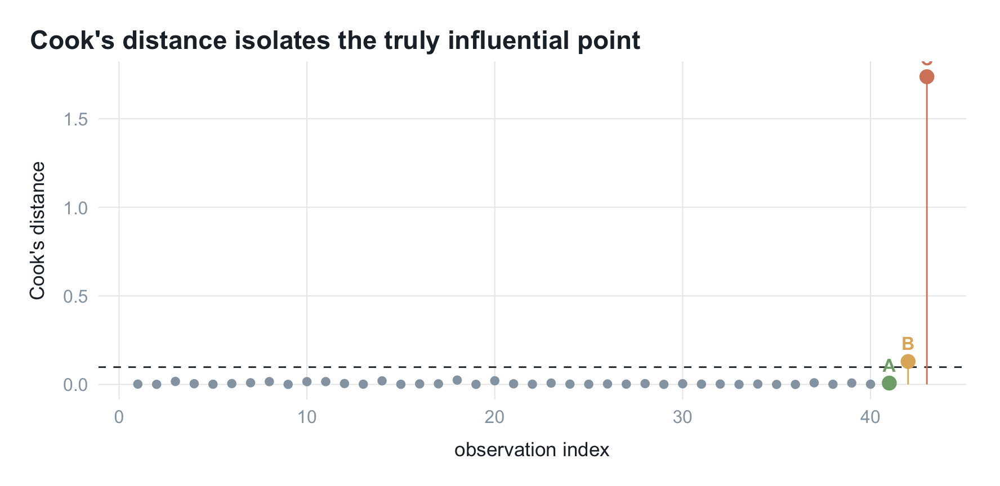
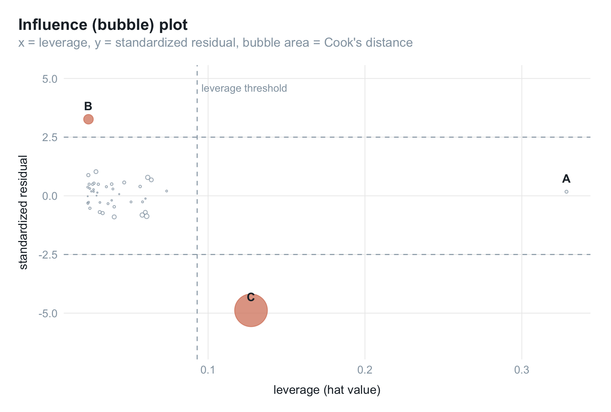
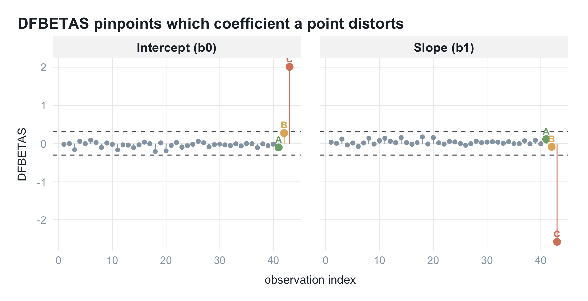
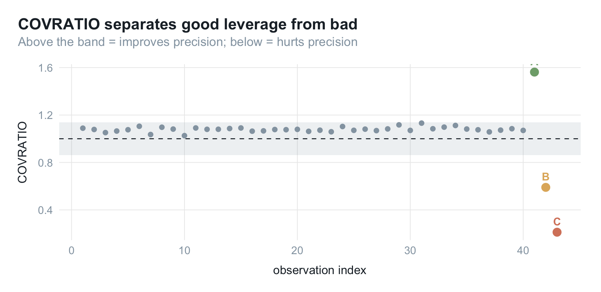

回归系数由全部样本共同决定。若个别点位置特殊，它对结果的话语权可能远大于其余点，甚至单独决定斜率正负。回归诊断就是查这件事：有没有这样的点、影响多大、要不要处理。

下面用一份模拟数据过一遍常用诊断量——各衡量什么、阈值取多少、图怎么看。先讲最基础的三个（标准化残差、杠杆值、库克距离），再看整合它们的影响图，最后补三个删除诊断（DFFITS、DFBETAS、COVRATIO）。

## 三种"不正常"的点

三个易混的概念先分清：

- **离群值（outlier）**：$y$ 远离预测值、残差大，$y$ 方向异常。
- **高杠杆点（high leverage）**：自变量远离其余样本，$x$ 方向异常；杠杆衡量它能对结果施加多大影响。
- **强影响点（influential point）**：删掉它回归方程会明显改变，不一定伴随大残差。

杠杆高未必影响大，残差大也未必撼动方程。最麻烦的是既在 $x$ 方向极端、又偏离整体趋势的点。下面造出这三类点，看每个指标各能抓到谁。

## 模拟数据

用一元线性回归演示，好处是回归线能直接画在散点图上、看得见被带偏；这些指标对多元回归同样成立，只是无法用二维散点图呈现。

真实关系设为 $y = 3 + 1.5x + \varepsilon$，生成 40 个正常点，再刻意加进三个特殊点 A、B、C：


``` r
library(tidyverse)
set.seed(2026)

n_base  <- 40
x_base  <- runif(n_base, 4, 12)
y_base  <- 3 + 1.5 * x_base + rnorm(n_base, 0, 1.2)
base    <- tibble(x = x_base, y = y_base, label = "normal")

# B：x 居中、y 大幅偏离 —— 离群点
# C：x 偏大、y 明显偏离趋势 —— 强影响点
xB <- 7;  yB <- 3 + 1.5 * xB + 9
xC <- 13; yC <- 7

# A：x 最极端（高杠杆），但 y 落在"其余数据所隐含的那条线"上 —— 顺趋势
# 这样它虽然杠杆最高，加入后几乎不改变方程，是"好杠杆点"的典型
rest    <- bind_rows(base, tibble(x = c(xB, xC), y = c(yB, yC), label = c("B", "C")))
xA      <- 17
yA      <- as.numeric(predict(lm(y ~ x, data = rest),
                              newdata = tibble(x = xA))) + 0.6

special <- tibble(label = c("A", "B", "C"),
                  x = c(xA, xB, xC),
                  y = c(yA, yB, yC))

dat <- bind_rows(base, special) |> mutate(obs = row_number())
n   <- nrow(dat)   # 样本量
p   <- 1           # 预测变量个数（系数个数为 p + 1）
```

先拟合全量回归，并和"剔除 C 之后"的回归放在一张图上对比：


``` r
fit    <- lm(y ~ x, data = dat)
fit_noC <- lm(y ~ x, data = filter(dat, label != "C"))

pts <- dat |>
  mutate(kind = recode(label,
                       normal = "normal",
                       A = "A: high leverage",
                       B = "B: outlier",
                       C = "C: influential"))

lab_pts <- filter(pts, label != "normal")

ggplot(pts, aes(x, y)) +
  geom_point(data = filter(pts, label == "normal"),
             color = palette_blog["ash"], size = 2, alpha = 0.8) +
  geom_abline(intercept = coef(fit)[1], slope = coef(fit)[2],
              color = palette_blog["blue"], linewidth = 0.9) +
  geom_abline(intercept = coef(fit_noC)[1], slope = coef(fit_noC)[2],
              color = palette_blog["rose"], linewidth = 0.9, linetype = 2) +
  geom_point(data = lab_pts, aes(color = kind), size = 3.4) +
  geom_text(data = lab_pts, aes(label = label, color = kind),
            vjust = -1, fontface = "bold", show.legend = FALSE) +
  annotate("text", x = 15.5, y = 27, label = "fit: all data",
           color = palette_blog["blue"], hjust = 0, size = 3.4) +
  annotate("text", x = 15.5, y = 23.2, label = "fit: without C",
           color = palette_blog["rose"], hjust = 0, size = 3.4) +
  scale_color_manual(values = unname(palette_blog[c("sage", "gold", "rose")])) +
  labs(title = "Three kinds of unusual points",
       subtitle = "Dropping the single point C visibly rotates the regression line",
       x = "x", y = "y", color = NULL) +
  theme_blog()
```



三个点位置各异：A 在最右端（$x$ 极端）但落在其余点连成的线上；B 的 $x$ 普通、$y$ 却高高抬起；C 的 $x$ 偏大、$y$ 又明显偏低。看实线（全量）与虚线（剔除 C）的夹角：只去掉 C，斜率就从 1.05 变到 1.33。能否左右回归线，和残差大小是两回事。

把五个诊断量一次性算出来备用，都来自 base R，不用额外装包：


``` r
d <- dat |>
  mutate(
    hat       = hatvalues(fit),
    std_resid = rstandard(fit),
    cooks     = cooks.distance(fit),
    dffits    = dffits(fit),
    covratio  = covratio(fit)
  )

thr <- list(
  hat     = 2 * (p + 1) / n,          # 杠杆值阈值
  cooks   = 4 / (n - p - 1),          # 库克距离阈值
  dffits  = 2 * sqrt((p + 1) / n),    # DFFITS 阈值
  dfbetas = 2 / sqrt(n),              # DFBETAS 阈值
  covr    = 3 * (p + 1) / n           # COVRATIO 阈值（偏离 1 的幅度）
)
```

先写一个通用的索引图函数：横轴是观测序号，纵轴是某个诊断量，把 A/B/C 三点标出来。


``` r
hl <- c(normal = unname(palette_blog["ash"]),
        A = unname(palette_blog["sage"]),
        B = unname(palette_blog["gold"]),
        C = unname(palette_blog["rose"]))

index_plot <- function(df, yvar, title, ylab, hlines) {
  ggplot(df, aes(obs, .data[[yvar]])) +
    geom_hline(yintercept = hlines, linetype = 2,
               color = palette_blog["ink"], linewidth = 0.4) +
    geom_segment(aes(xend = obs, yend = 0, color = label), linewidth = 0.4) +
    geom_point(aes(color = label, size = label != "normal")) +
    geom_text(data = filter(df, label != "normal"),
              aes(label = label, color = label),
              vjust = -0.9, fontface = "bold", size = 3.4, show.legend = FALSE) +
    scale_color_manual(values = hl, guide = "none") +
    scale_size_manual(values = c(1.6, 3), guide = "none") +
    labs(title = title, x = "observation index", y = ylab) +
    theme_blog()
}
```

## 指标一 · 标准化残差：抓离群值

标准化残差是残差除以自身标准误，读作"偏离回归线多少个标准误"：

$$
r_i = \frac{e_i}{\hat\sigma \sqrt{1 - h_{ii}}}
$$

常用它判定离群值，经验阈值取 $\pm 2.5$。R 里用 `rstandard()`：


``` r
index_plot(d, "std_resid",
           "Standardized residuals catch the outlier",
           "standardized residual", hlines = c(-2.5, 2.5))
```



B 冲出 $\pm 2.5$ 阈值线（3.26），C 更低至 -4.88；A 只有 0.18，完全正常。标准化残差只看 $y$ 方向偏离，抓不到藏在 $x$ 极端处的高杠杆点 A。

## 指标二 · 杠杆值：抓 x 方向的极端

杠杆值来自帽子矩阵。多元回归可写成 $\hat{Y} = HY$，其中

$$
H = X (X^{\top} X)^{-1} X^{\top}
$$

叫帽子矩阵是因为它给 $Y$ 戴上帽子变成 $\hat{Y}$。对角线元素 $h_{ii}$ 即第 $i$ 个观测的杠杆值，衡量其自变量有多极端；超过 $2(p+1)/n$ 算高杠杆。R 里用 `hatvalues()`：


``` r
index_plot(d, "hat",
           "Leverage catches the extreme-x points",
           "leverage (hat value)", hlines = thr$hat)
```



越线的是 A 和 C，残差很大的 B 因 $x$ 普通反而贴在底部。杠杆值只看 $x$ 的极端、不看 $y$，正好和标准化残差互补——一个管 $x$、一个管 $y$；但单看任一个都不足以判断有无影响。

## 指标三 · 库克距离：抓真正的强影响点

库克距离（Cook's distance）把前两者合一，同时考虑残差与杠杆：

$$
D_i = \frac{r_i^{2}}{p + 1} \cdot \frac{h_{ii}}{1 - h_{ii}}
$$

只有残差大、杠杆又高的点，$D_i$ 才被两个因子同时放大。阈值取 $4/(n - p - 1)$，R 里用 `cooks.distance()`：


``` r
index_plot(d, "cooks",
           "Cook's distance isolates the truly influential point",
           "Cook's distance", hlines = thr$cooks)
```



C 遥遥领先（$D_C =$ 1.74），把阈值线远远甩下；B 残差大但杠杆低，仅勉强越线；杠杆最高的 A 因顺着趋势，库克距离几乎为 0（0.008）。高杠杆不等于强影响。

## 影响图：一张图看全

把三个指标放进同一张图是常用画法：横轴杠杆值、纵轴标准化残差、点大小对应库克距离，超阈值的点填实。这种图叫影响图（influence plot）或气泡图（bubble plot）：


``` r
d <- d |> mutate(flagged = cooks > thr$cooks)

ggplot(d, aes(hat, std_resid)) +
  geom_hline(yintercept = c(-2.5, 2.5), linetype = 2,
             color = palette_blog["ash"], linewidth = 0.4) +
  geom_vline(xintercept = thr$hat, linetype = 2,
             color = palette_blog["ash"], linewidth = 0.4) +
  geom_point(aes(size = cooks, fill = flagged, color = flagged),
             shape = 21, alpha = 0.75) +
  geom_text(data = filter(d, label != "normal"),
            aes(label = label), fontface = "bold",
            vjust = -1.1, size = 3.6, color = palette_blog["ink"]) +
  scale_size_area(max_size = 13, guide = "none") +
  scale_fill_manual(values = c(`TRUE` = unname(palette_blog["rose"]),
                               `FALSE` = "white"), guide = "none") +
  scale_color_manual(values = c(`TRUE` = unname(palette_blog["rose"]),
                                `FALSE` = unname(palette_blog["ash"])),
                     guide = "none") +
  annotate("text", x = thr$hat, y = 4.6,
           label = "leverage threshold", hjust = -0.05,
           color = palette_blog["ash"], size = 3.2) +
  coord_cartesian(ylim = c(-6.4, 5), clip = "off") +
  labs(title = "Influence (bubble) plot",
       subtitle = "x = leverage, y = standardized residual, bubble area = Cook's distance",
       x = "leverage (hat value)", y = "standardized residual") +
  theme_blog()
```



各位置的含义：

- 越靠右杠杆越高，越远离 0 残差越大，气泡越大库克距离越大。
- C 在右下角，杠杆高、负残差大、气泡最大且填实，最该关注。
- B 在左上，残差越过 $y=2.5$ 但杠杆低、气泡不大，只是离群点。
- A 在最右侧贴着 $y=0$，杠杆最高但残差近零、气泡极小，高杠杆却无影响。

要盯的是既靠右、又远离中线、气泡还大的点。

## 剔除强影响点，方程变了多少

C 被诊断出来后，最直接的检验是删掉它、看系数变化多少：


``` r
comp <- tibble(
  term       = c("Intercept (b0)", "Slope (b1)"),
  full       = round(coef(fit), 2),
  without_C  = round(coef(fit_noC), 2)
) |>
  mutate(change_pct = round((without_C - full) / abs(full) * 100, 1))

knitr::kable(comp, col.names = c("Coefficient", "All data", "Without C", "Change (%)"),
             align = "lrrr")
```


|Coefficient    | All data| Without C| Change (%)|
|:--------------|--------:|---------:|----------:|
|Intercept (b0) |     6.08|      4.42|      -27.3|
|Slope (b1)     |     1.05|      1.33|       26.7|

斜率从 1.05 抬到 1.33（约 +26%），截距也明显回落。一个点就能改写"$x$ 每增一单位、$y$ 平均变化多少"的结论。样本量小时这种点必须查清：录入错误、量纲不一致，还是本不该纳入的异常记录。

> 样本量很大时单点几乎不可能有这么大权重，专门找强影响点意义有限；但在异常检测里，找出这种点恰恰是目的本身。

## 再细一点：三个删除诊断

实务里还常用三个更细的诊断量，思路一致：删掉第 $i$ 点重新拟合，看某个量变化多少。`influence.measures(fit)` 一行即可全算，这里为对照阈值分开算。

**DFFITS** 衡量删掉第 $i$ 点后，其自身拟合值变化了多少个标准误：

$$
\text{DFFITS}_i = \frac{\hat{y}_i - \hat{y}_{(i)}}{\hat\sigma_{(i)} \sqrt{h_{ii}}}
$$

阈值 $2\sqrt{(p+1)/n}$。它和库克距离高度相关，是从单点自身拟合值的角度看同一件事。

**DFBETAS** 更细，衡量删掉第 $i$ 点后每个回归系数各变化了多少个标准误：

$$
\text{DFBETAS}_{j,i} = \frac{\hat\beta_j - \hat\beta_{j(i)}}{\hat\sigma_{(i)} \sqrt{(X^{\top} X)^{-1}_{jj}}}
$$

阈值 $2/\sqrt{n}$。好处是能定位到具体系数，告诉你这个点动的是哪一个 $\beta$：


``` r
dfb <- dfbetas(fit) |>
  as_tibble() |>
  rename(`Intercept (b0)` = `(Intercept)`, `Slope (b1)` = x) |>
  mutate(obs = dat$obs, label = dat$label) |>
  pivot_longer(c(`Intercept (b0)`, `Slope (b1)`),
               names_to = "coef", values_to = "dfbetas")

ggplot(dfb, aes(obs, dfbetas)) +
  geom_hline(yintercept = c(-thr$dfbetas, thr$dfbetas), linetype = 2,
             color = palette_blog["ink"], linewidth = 0.4) +
  geom_segment(aes(xend = obs, yend = 0, color = label), linewidth = 0.4) +
  geom_point(aes(color = label, size = label != "normal")) +
  geom_text(data = filter(dfb, label != "normal"),
            aes(label = label, color = label),
            vjust = -0.7, fontface = "bold", size = 3, show.legend = FALSE) +
  scale_color_manual(values = hl, guide = "none") +
  scale_size_manual(values = c(1.4, 2.6), guide = "none") +
  facet_wrap(~ coef) +
  labs(title = "DFBETAS pinpoints which coefficient a point distorts",
       x = "observation index", y = "DFBETAS") +
  theme_blog()
```



两个面板里都是 C 冲得最远，截距和斜率都被它拽出阈值带，A、B 基本没动，与前面"删掉 C 系数大变"一致。

**COVRATIO** 换个角度，衡量删掉第 $i$ 点后系数估计的精度（协方差矩阵行列式）变化多少：

$$
\text{COVRATIO}_i = \frac{\det\big(\hat\sigma_{(i)}^{2} (X_{(i)}^{\top} X_{(i)})^{-1}\big)}{\det\big(\hat\sigma^{2} (X^{\top} X)^{-1}\big)}
$$

阈值是偏离 1 的幅度超过 $3(p+1)/n$，即 $\lvert \text{COVRATIO}_i - 1 \rvert \ge 3(p+1)/n$。读法和前面不同：

- $\text{COVRATIO}_i > 1$：删掉后估计变差，说明它在提升精度；
- $\text{COVRATIO}_i < 1$：删掉后估计变好，说明它在拖累精度。


``` r
band <- c(1 - thr$covr, 1 + thr$covr)
ggplot(d, aes(obs, covratio)) +
  annotate("rect", xmin = -Inf, xmax = Inf, ymin = band[1], ymax = band[2],
           fill = palette_blog["ash"], alpha = 0.15) +
  geom_hline(yintercept = 1, linetype = 2,
             color = palette_blog["ink"], linewidth = 0.4) +
  geom_point(aes(color = label, size = label != "normal")) +
  geom_text(data = filter(d, label != "normal"),
            aes(label = label, color = label),
            vjust = -0.9, fontface = "bold", size = 3.4, show.legend = FALSE) +
  scale_color_manual(values = hl, guide = "none") +
  scale_size_manual(values = c(1.6, 3), guide = "none") +
  labs(title = "COVRATIO separates good leverage from bad",
       subtitle = "Above the band = improves precision; below = hurts precision",
       x = "observation index", y = "COVRATIO") +
  theme_blog()
```



这张图的看点在 A：前面几个指标都放过了它，只有 COVRATIO 标出它。A 的 COVRATIO 为 1.56（带子上方），说明这个高杠杆点在稳住估计、删了反而更不准，是"好"杠杆点。C 则掉到 0.21（带子下方很远），删掉它精度明显变好，是要处理的坏点。

把三个点在所有指标上的表现汇成一张表：


``` r
mark <- function(cond) ifelse(cond, "✔", "–")

summ <- d |>
  filter(label != "normal") |>
  transmute(
    Point            = label,
    `Std. residual`  = mark(abs(std_resid) > 2.5),
    `Leverage`       = mark(hat > thr$hat),
    `Cook's D`       = mark(cooks > thr$cooks),
    DFFITS           = mark(abs(dffits) > thr$dffits),
    COVRATIO         = mark(abs(covratio - 1) > thr$covr)
  )

knitr::kable(summ, align = "lccccc")
```


|Point | Std. residual | Leverage | Cook's D | DFFITS | COVRATIO |
|:-----|:-------------:|:--------:|:--------:|:------:|:--------:|
|A     |      –       |    ✔     |    –    |   –   |    ✔     |
|B     |       ✔       |    –    |    ✔     |   ✔    |    ✔     |
|C     |       ✔       |    ✔     |    ✔     |   ✔    |    ✔     |

- A（高杠杆点）：只有 COVRATIO 标记，且是"好"的那种，其余指标都判无害。
- B（离群点）：残差类指标抓得到，杠杆类指标漏掉。
- C（强影响点）：几乎所有指标同时点名，才是真正要处理的点。

## 小结

这套指标各有分工：

- 标准化残差看 $y$ 方向偏离（离群值）；
- 杠杆值看 $x$ 方向极端；
- 库克距离和 DFFITS 合两者，衡量综合影响、锁定强影响点；
- DFBETAS 定位到具体哪个系数被动；
- COVRATIO 从精度角度看，还能分出好坏杠杆。

实际顺序：先看影响图扫出可疑大气泡，再用 DFBETAS 看它扰动了哪个系数、多大，最后结合业务判断修正、剔除还是保留。记住：样本量小时单点足以改写结论、务必查清；样本量大时不必纠结单点，把力气留给异常检测更划算。
