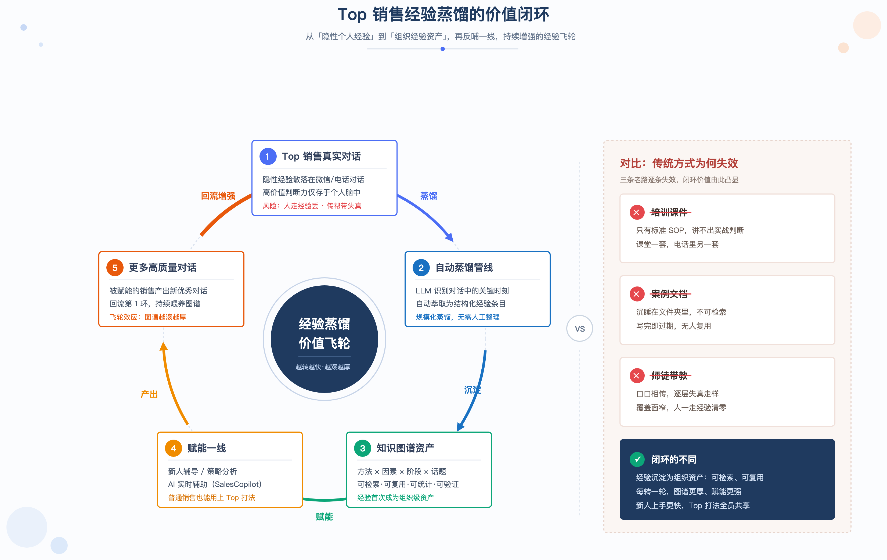
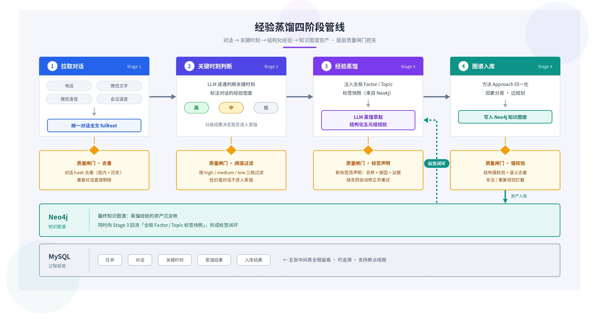
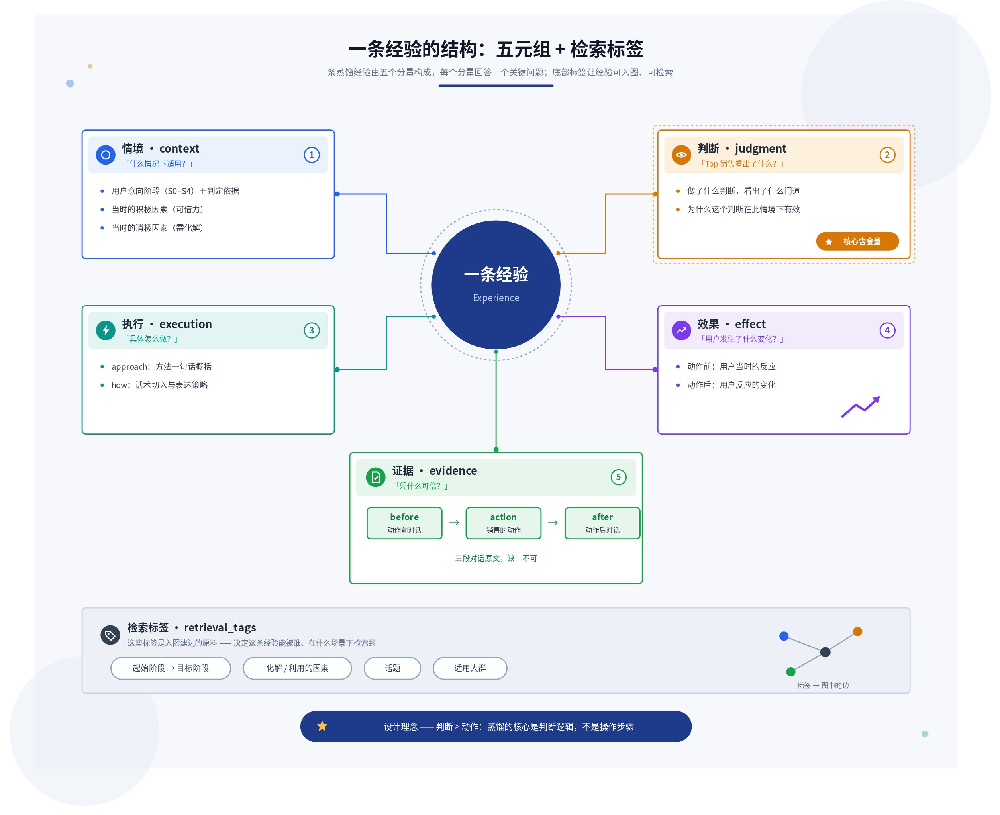
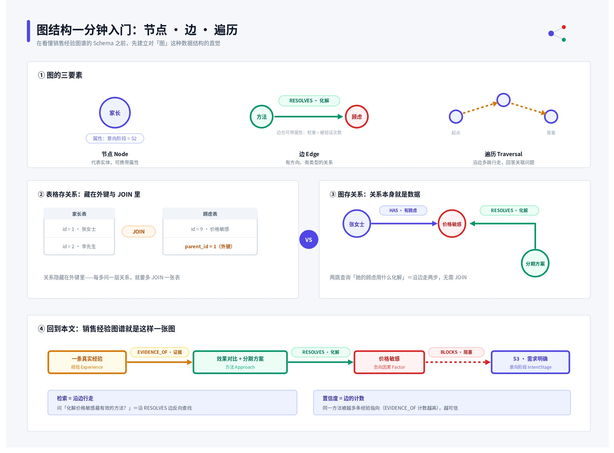
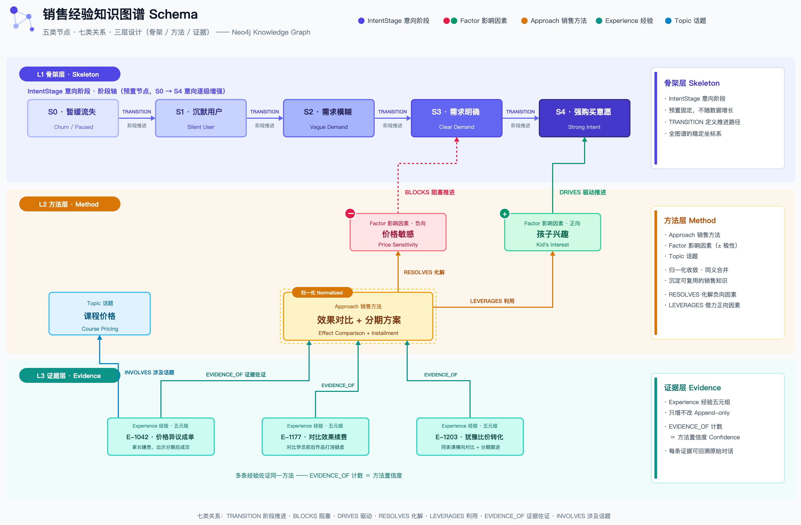
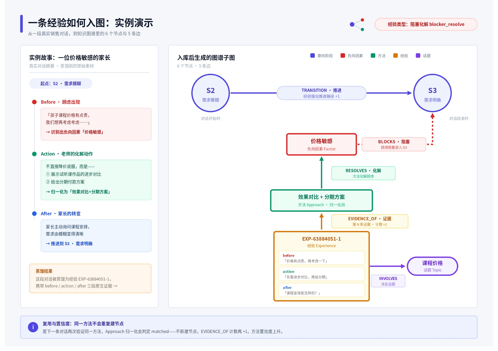
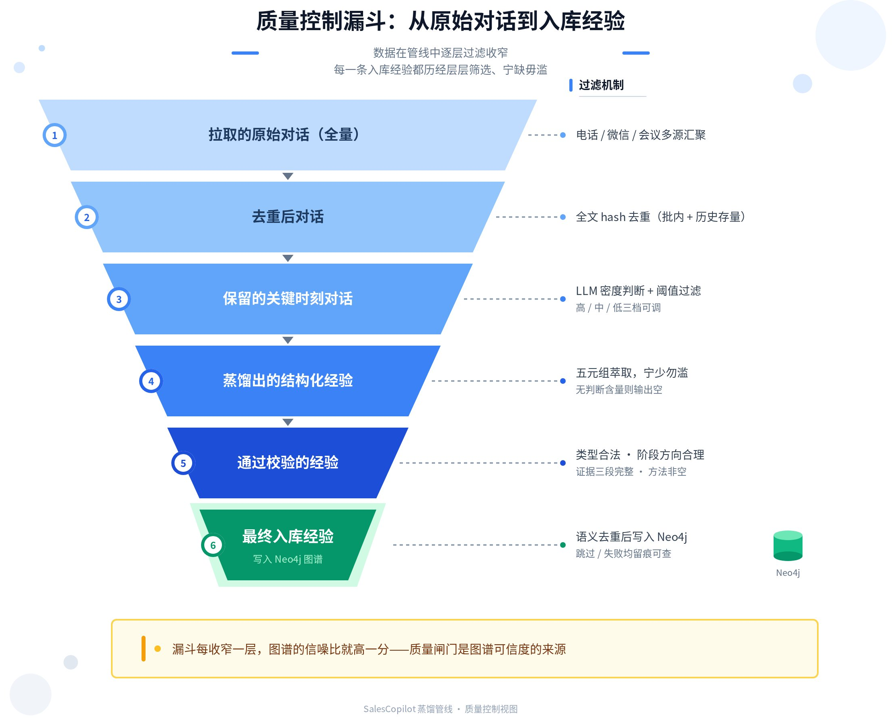

> **一句话定位**：把 Top 销售（班主任）散落在真实对话里的隐性经验，自动蒸馏成「情境 - 判断 - 执行 - 效果 - 证据」结构化资产，并沉淀为可检索、可复用、可统计的知识图谱，支撑销售辅导、案例检索与 AI 实时辅助。

## 一、为什么要蒸馏 Top 销售经验

Top 销售与普通销售的差距，不在标准 SOP 的执行，而在关键时刻的「非默认选择」——这些判断是隐性的，散落在成千上万条微信与电话对话中，人走经验丢，新人只能靠师徒传帮带缓慢习得。

传统的经验沉淀方式在这里全部失效：

- **培训课件**——沉淀的是标准 SOP，而真正拉开差距的恰恰是 SOP 之外的临场判断；
- **优秀案例文档**——纯文本总结，不可检索、不可统计、无法验证真伪；
- **师徒带教**——传递效率低，经验在转述中失真，且随人员流动而流失。

经验蒸馏要做的，是把隐性判断转化为组织级经验资产，实现四个「可」：

- **可检索**：按意向阶段、因素、话题精确定位打法；
- **可复用**：情境抽象到方法论层面，换个用户也适用；
- **可统计**：同一方法被多少真实对话验证，一目了然；
- **可验证**：每条经验必须带对话原文三段证据。

下图展示了从「隐性个人经验」到「组织经验资产」的价值闭环：

## 二、方法论总览：四阶段蒸馏管线

蒸馏不是「让大模型总结聊天记录」，而是一条带质量闸门的自动化管线：拉取对话、判断关键时刻、结构化萃取、图谱入库，每一阶段的中间结果均落库可追溯。

| 阶段 | 名称 | 做什么 | 质量闸门 |
|-|-|-|-|
| Stage 1 | **拉取对话** | 拉取电话、微信文字、微信语音、会议语音记录，统一整理为带时间和角色的对话全文 | 对话全文 hash 去重（批次内 + 历史存量），重复对话不进入后续环节 |
| Stage 2 | **关键时刻判断** | LLM 逐条判断对话是否值得提取，并标注经验密度（高 / 中 / 低） | 按阈值过滤，把昂贵的蒸馏算力只花在有价值的对话上 |
| Stage 3 | **经验蒸馏** | 注入全局因素 / 话题标签快照，LLM 萃取结构化五元组经验 | 新标签必须声明名称、原因、证据，否则触发自动修正重试 |
| Stage 4 | **图谱入库** | 销售方法归一化 → 因素分类 → 边规划 → 写入 Neo4j | 结构强校验 + 语义去重，失败与跳过均留痕 |

> **四条工程设计原则：**
>
> 1. **全自动**——提交样本即执行，无人工审核环节；
> 2. **异步执行**——长任务后台运行，支持暂停 / 恢复 / 取消，断点续跑不重复写入；
> 3. **中间结果全落库**——任务、对话、关键时刻、蒸馏结果、入库结果五张表，单条失败可精确定位，不需整批重跑；
> 4. **防御性解析**——LLM 输出多层容错，单条异常不阻断整批。

## 三、什么才算一条「经验」：五元组结构

纯文本总结不可检索、不可统计。本方法论把每条经验强制约束为五元组结构，缺一即拒绝入库。

五元组回答了「一条经验凭什么可信、凭什么可复用」——上图中每个分量各司其职。在此之上，每条经验还携带一组**检索标签**（起止意向阶段、化解 / 利用的因素、话题、适用人群），它们正是后续入图建边的原料。

| 经验类型 | 标签 | 判定标准 |
|-|-|-|
| **意向推进** | intent_advance | 用户意向阶段发生正向变化 |
| **阻塞化解** | blocker_resolve | 价格、时间、决策权等顾虑被化解或弱化 |
| **信号捕捉** | signal_capture | 捕捉用户释放的积极信号并有效放大 |
| **节奏把控** | pacing | 推进、暂停、转换话题的时机选择正确 |
| **信息承接** | context_leverage | 利用既有背景信息增强沟通针对性 |

> **四条萃取原则**：宁少勿滥——无判断含量就输出空；判断 > 动作——核心是判断逻辑而非操作步骤；可复用性 > 精确性——情境抽象到方法论层面；证据必须充分——before / action / after 三段原文缺一不可。

## 四、知识图谱结构设计（核心）

经验的价值不在单条内容，而在关系：方法化解了哪个因素、推动了哪段意向阶段、被多少条真实对话反复验证。这正是选择知识图谱而非文档库或纯向量库的原因。

在进入 Schema 细节之前，先补一块背景知识——什么是「图」这种数据结构。下图帮助不熟悉图数据库的读者快速建立直觉：图由节点与边构成，关系本身就是一等公民的数据，检索就是沿着边行走。

### 4.1 图谱 Schema：五类节点、七类关系

| 节点类型 | 含义 | 设计要点 |
|-|-|-|
| **IntentStage** | 用户意向阶段 S0～S4 | 图谱骨架，预置五个节点、不增长：S0 暂缓流失 → S1 沉默 → S2 需求模糊 → S3 需求明确 → S4 强购买意愿 |
| **Factor** | 影响因素（带正 / 负极性） | 如「价格敏感」「效果怀疑」（负）、「孩子兴趣」（正）；name + polarity 联合唯一，同名不同极性可共存 |
| **Approach** | 归一化后的销售方法 | 方法层核心资产；经归一化避免同一打法以不同措辞重复建节点 |
| **Experience** | 结构化经验（五元组） | 证据单元，携带对话原文三段证据，全局唯一 ID 保证幂等 |
| **Topic** | 话题标签 | 检索入口，如「课程价格」「学习效果」；全局唯一 |

| 关系类型 | 方向 | 语义 |
|-|-|-|
| **TRANSITION** | IntentStage → IntentStage | 意向阶段推进路径，权重随经验累积 |
| **BLOCKS** | 负向 Factor → IntentStage | 该因素阻塞用户在此阶段推进 |
| **DRIVES** | 正向 Factor → IntentStage | 该因素驱动用户向此阶段推进 |
| **RESOLVES** | Approach → 负向 Factor | 该方法化解此消极因素 |
| **LEVERAGES** | Approach → 正向 Factor | 该方法利用此积极因素 |
| **EVIDENCE_OF** | Experience → Approach | 该经验是此方法的一条真实对话证据 |
| **INVOLVES** | Experience → Topic | 该经验涉及此话题 |

### 4.2 分层设计与边规划

Experience 是证据层，Approach 是方法层；边由经验类型按决策矩阵规划生成。

> ⭐ **最关键的设计决策：证据层与方法层分离**。Experience（证据层）永远只增不改，Approach（方法层）通过归一化持续收敛。同一个方法被越多条真实经验指向（EVIDENCE_OF 计数越高），它的置信度就越高——图谱因此天然具备「方法强度统计」能力，而不需要任何人工打分。

**边规划决策矩阵**——不同经验类型只建立与其语义匹配的边，避免无差别连线造成图谱噪声：

| 经验类型 | TRANSITION | 负因素边（BLOCKS / RESOLVES） | 正因素边（DRIVES / LEVERAGES） |
|-|-|-|-|
| 意向推进 | ✅ 建立 | — | ✅ 建立 |
| 阻塞化解 | ✅ 建立 | ✅ 建立 | — |
| 信号捕捉 | ✅ 建立 | — | ✅ 建立 |
| 节奏把控 | 仅阶段跨越时建立 | — | — |
| 信息承接 | ✅ 建立 | 仅 BLOCKS | ✅ 建立 |

**Approach 归一化**：入库前按「同阶段路径 + 同类型 + 因素重叠 > 同路径 + 同类型 > 邻近路径」的优先级检索候选方法目录，交给 LLM 判定三种结果——**matched**（复用已有方法）、**revise**（修订已有方法表述）、**new**（确属新打法才新建）。这是控制方法层收敛、让 EVIDENCE_OF 计数有统计意义的前提。

### 4.3 一条经验如何入图（实例演示）

> **❓ 结构设计的最终检验标准：图谱能直接回答业务问题。**
>
> - 哪些方法最常把用户从「需求模糊」推进到「需求明确」？（沿 TRANSITION + EVIDENCE_OF 聚合）
> - 「价格敏感」通常阻塞在哪个阶段？化解它最有效的方法是什么？（BLOCKS + RESOLVES）
> - 哪些方法被最多真实对话验证过？（EVIDENCE_OF 计数排序）
> - 「学习效果」话题下有哪些可复用打法？（INVOLVES 反查）

## 五、质量控制：让图谱可信且不发散

没有质量控制的图谱会迅速膨胀成噪声。管线内置三层去重、全局标签闭环与入库强校验。

| 防重层级 | 机制 | 解决的问题 |
|-|-|-|
| **对话层** | 对话全文 hash 去重（批内 + 历史） | 同一段对话不重复消耗 LLM 算力，不重复产出经验 |
| **方法层** | Approach 归一化（matched / revise / new） | 同一打法不同措辞不会重复建节点，方法层持续收敛 |
| **经验层** | 语义去重（同方法 + 同阶段路径 + 因素高度重叠） | 过度相似的经验跳过入库，只保留有增量信息的证据 |

**全局标签闭环**——蒸馏前从图谱读取因素 / 话题标签全集快照注入提示词，要求 LLM 优先沿用已有标签；确需新建时必须声明名称、原因和原文证据，未声明的新标签触发自动修正重试；入库成功的新标签自动进入下一个任务的全集。这个闭环从根上防止了两类图谱退化：标签发散（同义因素以十种措辞各建一个节点）和孤立节点（有节点无边连接）。

> ✅ **入库强校验（缺一即拒绝）**：经验类型合法 · 意向阶段方向合理（目标阶段 ≥ 起始阶段）· 原文证据三段完整 · 销售方法非空。校验失败、语义重复、写入失败均逐条留痕，可精确定位。

## 六、价值衡量与应用场景

蒸馏效果可以被量化追踪，图谱资产直接服务于三类下游场景。

| 指标 | 口径 | 反映什么 |
|-|-|-|
| 对话有效率 | 保留关键时刻对话数 / 拉取对话数 | 样本选取质量 |
| 经验产出率 | 蒸馏经验数 / 保留对话数 | 蒸馏提取能力 |
| 入库成功率 | 入库成功经验数 / 蒸馏经验数 | 结构化质量 |
| 去重比例 | 跳过经验数 / 蒸馏经验数 | 样本重复度与图谱饱和度 |
| 方法复用率 | matched + revise 数 / 总入库经验数 | 方法层收敛程度——越高说明图谱越接近打法全集 |

图谱资产直接服务三类下游场景：

- **新人辅导**：按「意向阶段 + 因素」检索 Top 打法。新班主任遇到 S2 阶段价格敏感的家长，直接查到被验证最多的化解方法及原文案例。
- **AI 实时辅助**：SalesCopilot 实战技能查询图谱，结合用户当前意向阶段与顾虑，实时给出蒸馏经验支撑的推进建议。
- **策略分析**：管理层俯瞰因素分布与阶段阻塞热点，哪些顾虑最普遍、哪段推进最难，指导培训与话术资产投入。
