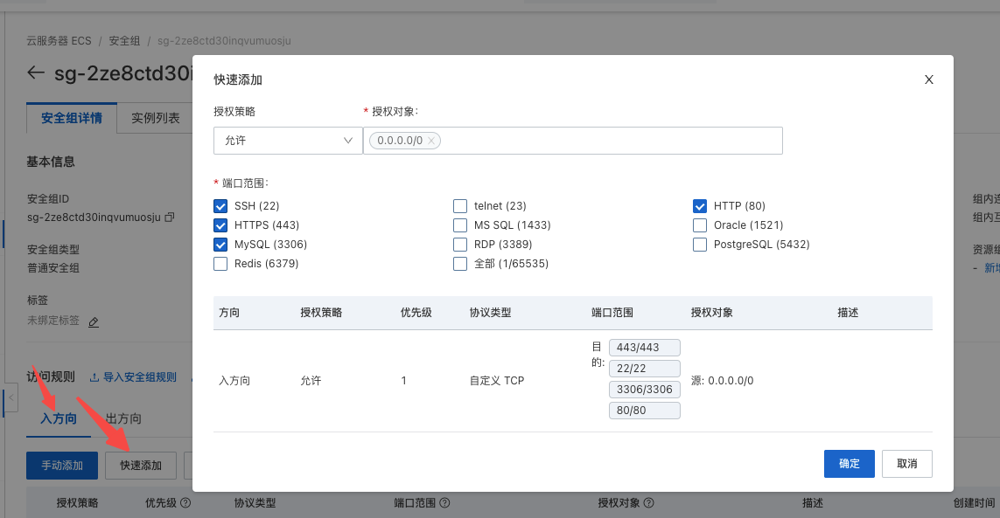
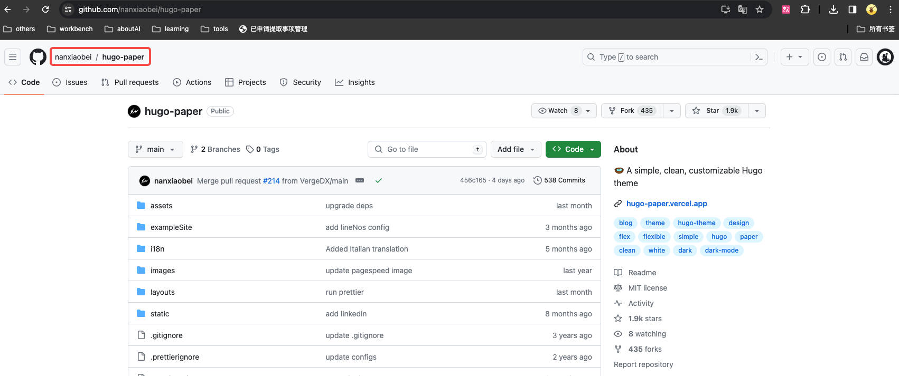
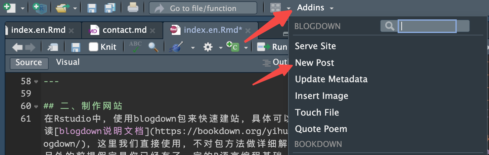

搭建这个Blog的起因是这样的...  

有次无意中刷到下面这个阿里云的活动，99元1年的云服务器，这个羊毛怎能有不薅的道理！？2核2G虽然干不了重活，但搭个blog绰绰有余，所以，为了这口醋，咱们今天就来包顿饺子(从服务器购买到网站上线)。


---

## 一、服务器准备
1. 购买服务器
- 登录[阿里云](https://www.aliyun.com/)去购买云服务器，可以选择“99元活动产品”也可以根据自己的要求配置。
- 注意系统镜像选择Ubuntu，因为本教程是基于Ubuntu系统


2. 安全组配置
- 在“选配”时或购买成功后进入“云服务器ECS”控制台-点击“实例名称”-“安全组”-“管理规则”-“快速添加”


- 添加安全组规则，开放必要的端口


3. 账号权限配置
- 打开本地终端，ssh连接登录root账号
```bash
ssh root@xxx.xxx.xxx.xxx  # xxx替换为你的服务器ip
``` 
- 创建一个用户(比如我的用户名：guowei)
```bash
adduser guowei
```
- 设置用户密码
```bash
passwd guowei
```
- 分配管理员权限
```bash
# 进入权限配置文件
visudo
```
- 将用户添加到root下，配置与root相同权限并保存


- 退出root连接，之后可以使用新创建的用户登录

---

## 二、制作网站
在Rstudio中，使用blogdown包来快速建站，具体可以阅读[blogdown说明文档](https://bookdown.org/yihui/blogdown/)，这里我们直接使用，不对包方法做详细解释，另外的前提假定是你已经有了一定的R语言编程基础。
1. 安装blogdown
```r
install.packages('blogdown')
```
2. 创建blogdown项目


上图中的Hugo theme是网站的主题模板，这里配置的是默认模板，你也可以到[https://themes.gohugo.io ](https://themes.gohugo.io)上选择自己喜欢的模板，比如本站点使用的是[Paper](https://themes.gohugo.io/themes/hugo-paper/)这个主题，你可以进入主题点击“Download”进入项目。

而github的项目名称就是主题模板名称，你可以很方便的将模板名称替换到Hugo theme的配置里，比如：



3. 预览网站

blogdown包提供了很多非常便利的功能，比如：
```r
# 预览网站，并且可以实时预览网站修改效果
blogdown::serve_site()
```

4. 修改网站

- `/content/post/`路径下的文件就是文章内容了，如果要添加新文章可以使用Rstudio插件快捷创建

插件中也提供了很多其他的快捷功能，比如“插入图片”。
- `config.yaml`是网站的配置文件，比如网站标题、社交账号等，可以根据自己需要做修改
- `themes/`路径下的内容是模板设计相关的代码，如果想要修改，建议有一些前端开发的经验

5. 生成网站

修改完毕后，现在我们可以生成静态网站了，blogdown包同样提供了非常方便的方法：
```r
blogdown::build_site()
```

如果看到类似上图的输出，说明站点已经生成，此时你的项目中会出现一个`public`目录，该目录下的内容就是你的静态站点了。  
所以，我们每次修改或添加完内容，都需要重新`build_site()`，  

接下来，我们只需要将`public`部署到服务器端即可。

---

## 三、网站部署
1. 服务器登录
```bash
ssh username@xxx.xxx.xxx.xxx
```

2. 上传站点
- 把`public`目录上传到服务器的`/data/wwwroot/`目录下
```bash
scp -r yourpath/public/ yourname@xxx.xxx.xxx.xxx:/data/wwwroot

# 如果服务器没有该目录，需要先创建
# 切到根目录后
sudo mkdir data/wwwroot
```
- 这一步也可以使用git把项目clone到服务器目录，之后修改内容会更加方便一些

3. Nginx
- sudo权限下安装nginx
```bash
sudo apt install nginx
```
- 启动nginx服务
```bash
sudo systemctl start nginx
```
验证安装：打开Web浏览器，并访问服务器的IP地址，如果看到Nginx的欢迎页面，那么Nginx已经成功安装并运行。

- 进入nginx配置文件目录
```bash
cd /etc/nginx/conf.d
```
- 创建配置文件
```bash
vim myblog.conf
```
- 添加配置内容并保存
```yaml
server{
                server_name www.xiebro.cool; # 如果没有域名也可以用公网ip
                location / {
                        root /data/wwwroot/public;
                        index index.html;
                }
      }
```

- 重启nginx服务

```bash
sudo systemctl restart nginx
```

- 浏览器中使用`http`访问域名或公网ip，现在应该可以看到网站内容了

4. 域名与SSL证书

- 域名解析

假设你已经注册了域名并且做了备案，需要到域名控制台添加解析记录，比较简单，具体方法这里不做介绍了。

- SSL证书

这里介绍一个免费的SSL证书工具[certbot](https://certbot.eff.org/instructions?ws=nginx&os=ubuntufocal)，根据该网站教程配置SSL证书后，就可以使用`https`进行访问了（当然前提是你已经有备案好的域名）。
